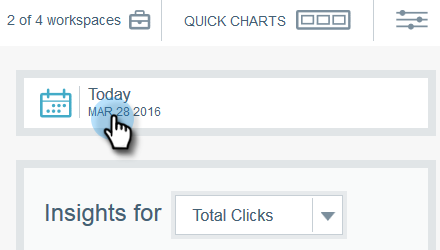
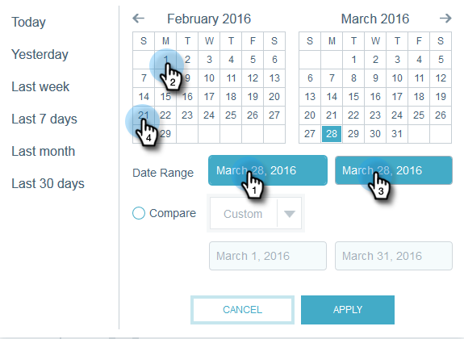
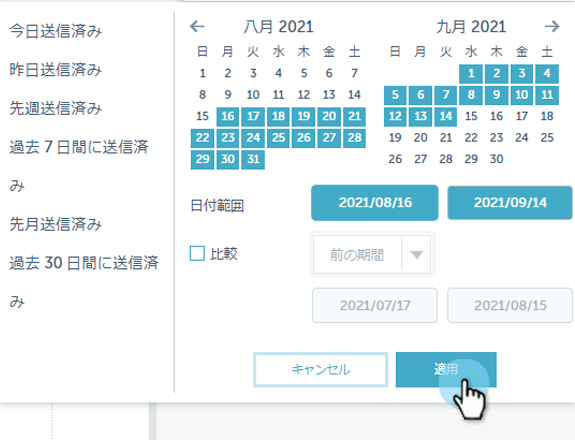
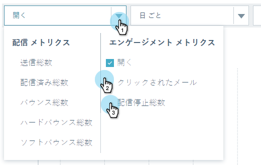
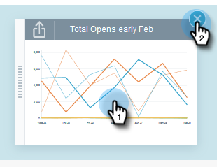

# メールインサイトのクイックグラフ {#email-insights-quick-charts}

クイックグラフは、カスタマイズして保存するサムネールで、最も多く使用するグラフを素早く表示できます。

## 新しいクイックグラフの作成 {#create-a-new-quick-chart}

この例では、カリフォルニア州とフロリダ州での 2016 年 2 月の最初の 3 週間の開封率を選択します。

1. [!UICONTROL 分析]画面の右側で日付フィルターをクリックします。

   

1. 目的の日付範囲を選択します。

   

1. 日付範囲を選択したら、「**[!UICONTROL 適用]**」をクリックします。

   

1. 日付が適用されると、グラフが変更されます。

   

1. 1 番目のドロップダウンをクリックします。 クリックして条件を選択し（まだ選択されていない場合）、不要な条件の選択を解除します。

   

1. グラフの右側で、エクスポートアイコンをクリックし、「**[!UICONTROL クイックチャートとして保存]**」を選択します。

   

1. クイックグラフに名前を付け、「**[!UICONTROL 保存]**」をクリックします。

   

   >[!NOTE]
   >
   >最大 20 個のクイックグラフを使用できます。 削除して置き換えることができます。

1. 新しいクイックチャートが他のチャートと共に表示されるようになります。

   

   >[!TIP]
   >
   >クイックチャートを移動するには、クリックして目的の位置にドラッグします。

## クイックチャートの削除 {#delete-a-quick-chart}

クイックチャートは削除するのも 簡単です！

1. 「**[!UICONTROL クイックグラフ]**」アイコンをクリックします。

   

1. 目的のグラフにカーソルを置きます。ただし、クリックはしません。 カーソルを合わせると、「X」が表示されます。 「**X**」をクリックします。

   

1. 「**[!UICONTROL OK]**」をクリックします。

   

   これで、クイックチャートが削除されました。 簡単だと言いましたよね。
