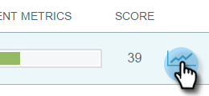

# 電子メールインサイトから概要が送信される {#email-insights-sends-overview}

[送信]ページで、最近の電子メール通信の特性を確認します。

[フィルタリングを使用して](filtering-in-email-insights.md) 、表示する電子メールを指定します。

ページの右側には、送信された電子メールに関する情報がいくつかあります。

**「Type** 」は、使用するアセットの種類を示します。\
**受信者** 番号は、電子メールを送信した人の数です。\
**配信指標** ：配信された電子メール、保留中の電子メール、またはバウンスした電子メールの数を簡単に表示できます。\
**エンゲージメント指標** ：電子メールから開いた、クリックした、登録解除した受信者の数を簡単に表示できます。\
**スコア** は、電子メールの [エンゲージメントスコアです](../../../product-docs/email-marketing/drip-nurturing/reports-and-notifications/understanding-the-engagement-score.md)。

デフォルトでは、電子メールは最新のもので並べ替えられますが、使用可能な任意の指標で並べ替えることができます。

>[!NOTE]
>
>電子メールは、プログラム名またはキャンペーン名（上）と電子メールアセット名（下）で一覧表示されます。

Analyticsで電子メールの統計を表示する場合は、「スコア」の横にマウスポインターを置き、グラフアイコンをクリックします。   

かっこいい！

>[!NOTE]
>
>**関連記事**
>
>[電子メールインサイト分析の概要](email-insights-analytics-overview.md)

