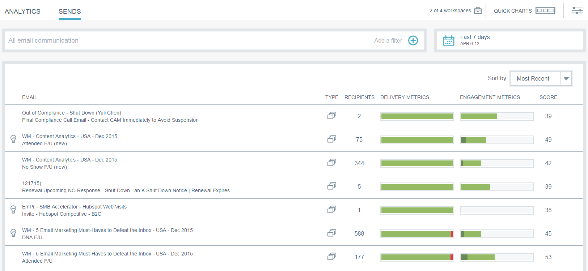

# メールインサイトの送信の概要 {#email-insights-sends-overview}

[!UICONTROL 送信]ページでは、最近のメール通信の特性を調べます。

[フィルタリング](/help/marketo/product-docs/reporting/email-insights/filtering-in-email-insights.md)を使用して、表示するメールを指定します。

ページの右側には、送信したメールに関する情報がいくつかあります。

**[!UICONTROL タイプ]**は使用されるアセットの種類を示します。
**[!UICONTROL 受信者]**数は、メールを送信した人数です。
**[!UICONTROL 配信指標]**を使用すると、配信されたメールの数、保留中のメールの数、バウンスしたメールの数をすばやく確認できます。
**[!UICONTROL エンゲージメント指標]**を使用すると、メールを開封、クリックイン、登録解除した受信者の数を簡単に確認できます。
**[!UICONTROL スコア]**&#x200B;はメールの[エンゲージメントスコア](/help/marketo/product-docs/email-marketing/drip-nurturing/reports-and-notifications/understanding-the-engagement-score.md)です。

デフォルトでは、メールは最新の指標で並べ替えられますが、使用可能な任意の指標で並べ替えることができます。

>[!NOTE]
>
>メールは、プログラム名またはキャンペーン名（上）とメールアセット名（下）で表示されます。

分析でメールの統計を表示する場合は、「スコア」の横にマウスポインタを合わせて、グラフアイコンをクリックします。

便利です。

>[!MORELIKETHIS]
>
>[メールインサイトのアナリティクスの概要](/help/marketo/product-docs/reporting/email-insights/email-insights-analytics-overview.md)
