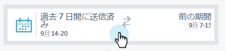
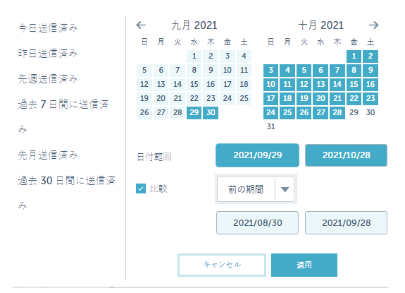

# 電子メールインサイトでのフィルタリング{#filtering-in-email-insights}

電子メールインサイトには、データをフィルターする様々な方法があります。

## メールインサイト {#email-insights}

「+」をクリックしてフィルターを追加する開始を選択します。 好き追加なだけ。

同じカテゴリに複数のフィルターがある場合は、フィルターが結合され、金額が表示されます。

適用したフィルターを確認する必要が生じた場合は、フィルターをクリックします。 さらに追加することもできます。

別のタイプのフィルターを追加することもできます。

もっとフィルターが！

グラフは、各フィルターが適用されると変更されます。

カテゴリを削除するには、「X」をクリックします。

すべてのフィルターをクリアするには、フィルターバーの末尾にあるXをクリックします。

日付固有のデータの場合は、日付範囲を使用します。

共通のプリセット日付範囲から選択し、特定の日付を選択します。比較には前の期間も使用します。

>[!NOTE]
>
>日付範囲は、Analyticsページと送信ページの両方に適用されます。 「**比較**」オプションは、Analyticsページにのみ適用できます。

## アカウントベースドマーケティング {#account-based-marketing}

[ターゲットアカウント管理](https://docs.marketo.com/display/DOCS/Account+Based+Marketing+Overview)を使用する場合は、特別なフィルターがあります。

