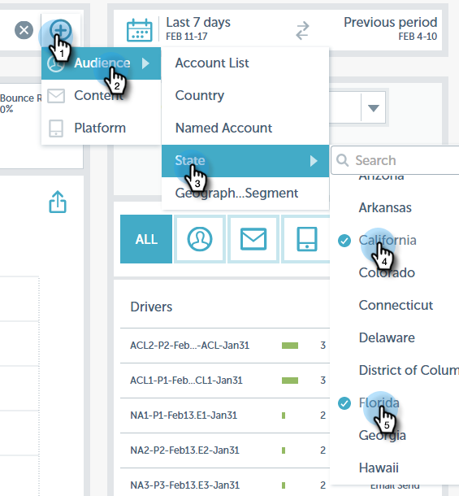
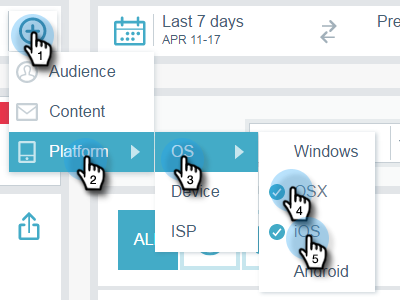
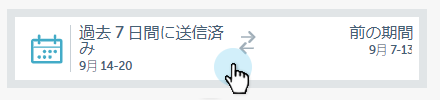
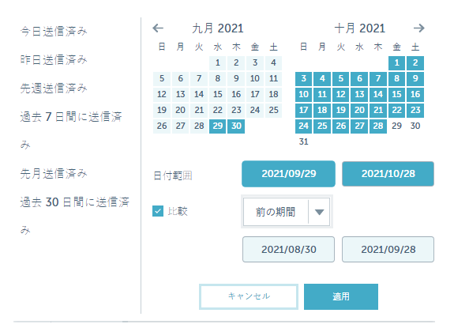

# [!UICONTROL メールインサイト]におけるフィルター {#filtering-in-email-insights}

[!UICONTROL メールインサイト]では、データをフィルターする方法が異なります。

## [!UICONTROL メールインサイト] {#email-insights}

「+」をクリックして、フィルターの追加を開始します。 必要な数だけ追加してください。

同じカテゴリーで複数のフィルターがある場合は、結合されてその数が表示されます。

どのフィルターを適用したか確認が必要な場合は、フィルターをクリックするだけです。 そこからさらに追加することもできます。

フィルターのタイプを追加することもできます。

さらにフィルターも増やせます。

フィルターを適用すると、チャートが変化します。

カテゴリーを削除するには、「X」をクリックします。

すべてのフィルターをクリアするには、フィルターバーの最後にある「X」をクリックします。

日付固有のデータの場合は、日付範囲を使用します。

共通のプリセット日付範囲から選択するか、特定の日付を選択します。以前の日付範囲と比較することもできます。

>[!NOTE]
>
>日付範囲は、[!UICONTROL 分析]ページと[!UICONTROL 送信数]ページの両方に適用されます。 ただし、「**比較**」オプションは[!UICONTROL 分析]ページにのみ適用できます。

## アカウントベースドマーケティング {#account-based-marketing}

[[!UICONTROL ターゲットアカウント管理]](https://docs.marketo.com/display/DOCS/Account+Based+Marketing+Overview)を使用する場合は、専用のフィルターがあります。

