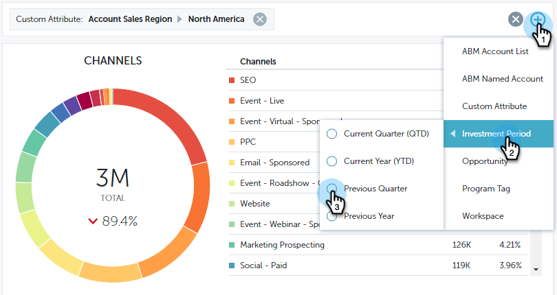

# パフォーマンスインサイトのフィルタリング {#filtering-in-performance-insights}

データを簡単にフィルタリングして、特定の情報に対してクエリを実行します。

「+」をクリックして、フィルターの追加を開始します。

>[!NOTE]
>
>現時点では、カスタム属性は、収益サイクル分析を有効にしている顧客のみがフィルターで使用できます。

1 つのカテゴリをクリックすると、複数のサブカテゴリが表示されます。

サブカテゴリを選択し、値を検索またを選択します。

選択したフィルターを反映してグラフが更新されます。

同じ手順に従って、フィルターを追加できます。

フィルターの横の「X」をクリックすると、いつでもフィルターを削除できます。すべてのフィルターを一度に削除するには、右端の「X」をクリックします。

## 使用可能なフィルター {#available-filters}

<table> 
 <tbody> 
  <tr> 
   <td colspan="1"><strong>ABM アカウントリスト</strong></td> 
   <td colspan="1">Marketo ABM を使用している場合、すべてのアカウントリストが MPI と同期され、「ABM アカウントリスト」フィルターで表示されます。顧客リストを選択して、その顧客に対して結果をフィルタリングできます。ABM 顧客リストについて詳しくは、<a href="https://docs.marketo.com/display/public/DOCS/Account-Based+Web+Marketing+with+ABM" rel="nofollow">こちら</a>をご覧ください。</td> 
  </tr> 
  <tr> 
   <td colspan="1"><strong>ABM 重点顧客</strong></td> 
   <td colspan="1">Marketo ABM を使用している場合、すべての重点顧客が MPI と同期され、「ABM 重点顧客」フィルターで表示されます。重点顧客を選択して、その顧客に対して結果をフィルタリングできます。ABM 重点顧客について詳しくは、<a href="https://docs.marketo.com/x/eaCt" rel="nofollow">こちら</a>をご覧ください</td> 
  </tr> 
  <tr> 
   <td colspan="1"><strong>カスタム属性</strong></td> 
   <td colspan="1">
これらは、お客様によって決定されます。<a href="/help/marketo/product-docs/reporting/revenue-cycle-analytics/revenue-tools/enabling-custom-field-sync-for-revenue-cycle-analytics.md" rel="nofollow">有効にした</a>すべてのフィールドの商談の分析は、パフォーマンスインサイトでフィルタリングできます。
</td> 
  </tr> 
  <tr> 
   <td colspan="1">
<strong>投資期間</strong>
</td> 
   <td colspan="1">
プログラムコスト時間枠。
</td> 
  </tr> 
  <tr> 
   <td colspan="1">
<strong>商談のタイプ</strong>
</td> 
   <td colspan="1">
Salesforce(CRM) 設定の商談オブジェクトに設定された商談のタイプ。
</td> 
  </tr> 
  <tr> 
   <td>
<strong>プログラムタグ</strong>
</td> 
   <td>
タグは、プログラムの説明に用いられます。タグは、必要なだけ、固有の値を設定して作成できます。プログラムタグの使用方法については、<a href="/help/marketo/product-docs/administration/tags/create-a-new-program-tag-and-tag-values.md" rel="nofollow">こちら</a>を参照してください。
</td> 
  </tr> 
  <tr> 
   <td><strong>ワークスペース</strong></td> 
   <td>
ワークスペースは、プログラム、ランディングページ、メールなどの Marketo のマーケティングアセットを保持する別々の領域です。ワークスペースについて詳しくは、<a href="/help/marketo/product-docs/administration/workspaces-and-person-partitions/understanding-workspaces-and-person-partitions.md" rel="nofollow">こちら</a>をご覧ください。
</td> 
  </tr> 
 </tbody> 
</table>

>[!NOTE]
>
>エンゲージメントダッシュボードでは、プログラムタグとワークスペースフィルターのみを使用できます。
