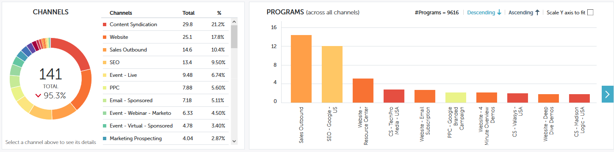

# パフォーマンスインサイトの貢献度の概要 {#performance-insights-contribution-overview}

Marketo パフォーマンスインサイトでは、貢献度ビューがデフォルトで表示されます。

パフォーマンスを表示する指標を選択します。この例では、売上高ダッシュボードのマルチタッチで成立した商談を見てみます。

>[!NOTE]
>
>[ファーストタッチとマルチタッチについては、こちらを参照](/help/marketo/product-docs/reporting/revenue-cycle-analytics/revenue-tools/attribution/understanding-attribution.md)してください。

指標を表示する期間を選択します。この例では、現在の年（年初から本日）を見ています。

>[!NOTE]
>
>「前年」の選択を一時的に解除しました。「カスタム範囲」選択を使用することで、引き続き、前年のパフォーマンスデータ全体を表示するオプションがあります。

指標は、ドーナツグラフと棒グラフで表示されます。

ドーナツグラフには、選択した指標の上位 10 チャネルが表示されます。

棒グラフには、選択した指標のすべてのチャネル（一度に 10 プログラム）にわたるプログラムのパフォーマンスが表示されます。さらに表示するには、右側の矢印をクリックして、次のグループにスクロールします。

>[!TIP]
>
>グラフ内のバーを拡大してグループ間をスクロールする場合は、「**Y 軸を拡大・縮小して合わせる**」チェックボックスをオンにします。

グラフの棒にマウスを移動すると、詳細が表示されます。

ドーナツグラフで 1 つ以上のチャンネルを選択すると、それらのチャンネルに関連するすべてのプログラムが右側の棒グラフに表示されます。選択を解除するには、チャネルをもう一度クリックします。

以下のデータグリッドは、スプレッドシートのように機能し、選択したアトリビューションモデル（ファーストタッチ／マルチタッチ）で使用可能なすべての指標を表示します。選択した指標を含む列がハイライト表示されます。

| **成立した商談** | 成立した商談に影響を与えたとしてプログラムが受け取ったクレジットの一部（数値） |
|---|---|
| **獲得した売上高** | 成立した商談に影響を与えたとしてプログラムが受け取ったクレジットの一部（金額） |
| **コスト** | プログラムの総コスト |
| **成立した商談あたりのコスト** | プログラムコストと、新規商談の創出に影響を与えたとしてプログラムが受け取ったクレジットの一部（数値）との比率 |
| **獲得した売上高対コスト比** | 新規商談の創出に影響を与えたとしてプログラムが受け取ったクレジットの一部（金額）と、プログラムコストの比率 |

チャネルを展開して、上位 10 件のプログラムと残りのプログラムを組み合わせます。

>[!NOTE]
>
>チャンネルの横にあるチェックボックスをクリックすると、上のドーナツグラフでチャンネルがアクティブ／非アクティブになります。
