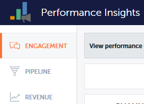
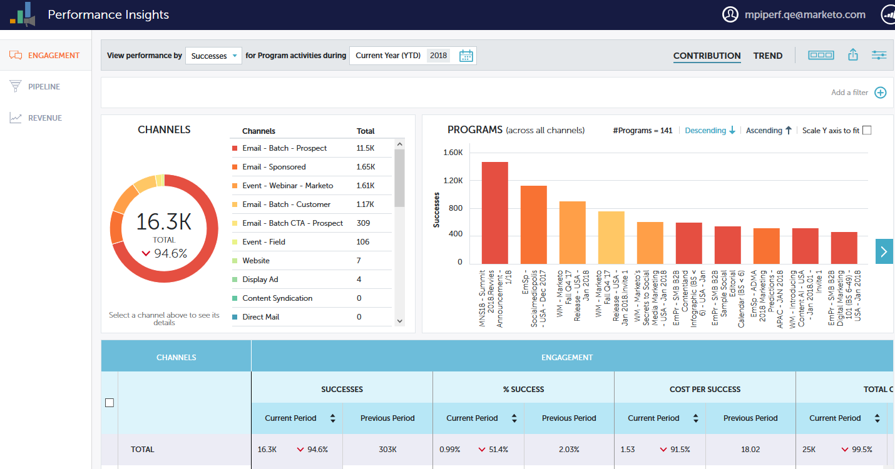
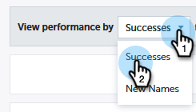
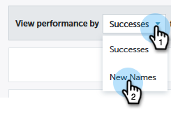
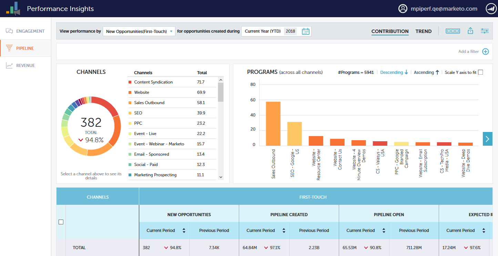
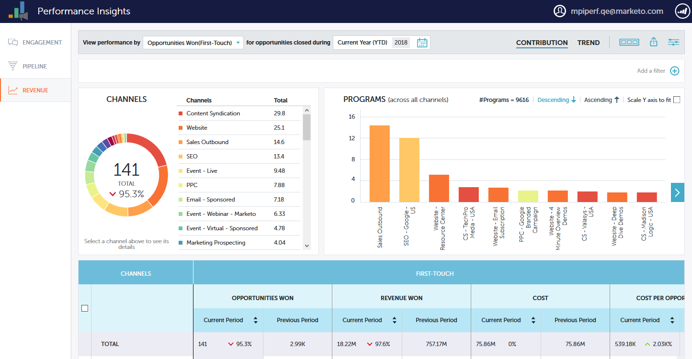

# [!UICONTROL パフォーマンスインサイト]ダッシュボード {#performance-insights-dashboards}

MPI で利用できるダッシュボードの詳細について説明します。

## [!UICONTROL エンゲージメント] {#engagement}

[!UICONTROL エンゲージメント]ダッシュボードは、ナーチャリングと新しい名前獲得プログラムの効果を測定するのに役立ちます。

オーディエンスエンゲージメントの測定

ナーチャリングプログラムでのオーディエンスのエンゲージメントを測定するには、**[!UICONTROL 成功]**&#x200B;指標を選択します。 成功は、Marketo での有意義なインタラクションの尺度です。

プログラムの目的は、リードまたは見込み客との有意義なインタラクションを作成することです。 成功は、人物がその目標に達成するステータスに達したときにマークされます。 オンラインセミナーへの参加、メールのリンククリック、web フォームの記入などです。 成功は、プログラムチャネルによって異なります。

>[!NOTE]
>
>ウェビナープログラムには、招待、登録、出席のような複数のステータスがあります。 「招待」や「登録」は、実際にウェビナーを見たわけではないので、意味のあるインタラクションではありません。 この場合、「出席済み」は成功と見なされます。

新しい名前取得の測定

新しい名前の獲得プログラムの効果を測定するには、**[!UICONTROL 新しい名前]**&#x200B;指標を使用します。

>[!NOTE]
>
>このダッシュボードで最良の結果を得るには、すべてのプログラムを設定して、新規顧客獲得プログラムとリードの取得日を設定する必要があります。

## [!UICONTROL パイプライン] {#pipeline}

[!UICONTROL パイプライン]ダッシュボードには、ファーストタッチ指標とマルチタッチ指標によるチャネルパフォーマンスが表示されます。

<table>
 <tbody>
  <tr>
   <td>
<strong>新しい商談</strong>
</td>
   <td>
新規商談の創出に影響を与えたとしてプログラムが受け取ったクレジットの一部。 複数のリードが関与する場合は分数の場合もあります。
</td>
  </tr>
  <tr>
   <td>
<strong>創出されたパイプライン</strong>
</td>
   <td>
新規商談の創出に影響を与えたとしてプログラムが受け取ったクレジットの一部（金額）。 複数のリードが関与する場合は総額の割合である場合もあります。
</td>
  </tr>
  <tr>
   <td>
<strong>オープンのパイプライン</strong>
</td>
   <td>
まだ開いている商談の創出に影響を与えたとしてプログラムが受け取ったクレジットの一部（金額）。 複数のリードが関与する場合は総額の割合である場合もあります。
</td>
  </tr>
  <tr>
   <td>
<strong>予想収益</strong>
</td>
   <td>
新規商談の創出に影響を与えたとしてプログラムが受け取ったクレジットの一部（金額）。 期待収益は商談の確率掛ける商談の価値です。 複数のリードが関与する場合は分数の場合もあります。
</td>
  </tr>
  <tr>
   <td>
<strong>創出された商談あたりのコスト</strong>
</td>
   <td>
新規商談に影響を与えたプログラムのコストの部分を、作成された新規商談の合計数で割った値。
</td>
  </tr>
  <tr>
   <td>
<strong>創出されたパイプライン対コスト比</strong>
</td>
   <td>
新規商談の創出に影響を与えたとしてプログラムが受け取ったクレジットの一部を、商談の創出に影響を与えたプログラムのコストの部分で割った部分。
</td>
  </tr>
 </tbody>
</table>

## [!UICONTROL 収益] {#revenue}

[!UICONTROL 収益]ダッシュボードには、ファーストタッチ指標とマルチタッチ指標によるチャネルパフォーマンスが表示されます。

<table>
 <tbody>
  <tr>
   <td>
<strong>成立した商談</strong>
</td>
   <td>
成立した商談に影響を与えたとしてプログラムが受け取ったクレジットの一部。
</td>
  </tr>
  <tr>
   <td>
<strong>獲得した売上高</strong>
</td>
   <td>
成立した商談に影響を与えたとしてプログラムが受け取ったクレジットの一部（金額）。
</td>
  </tr>
  <tr>
   <td>
<strong>成立した商談あたりのコスト</strong>
</td>
   <td>
新規商談に影響を与えたプログラムのコストの部分を、作成された新規商談の合計数で割った値。
</td>
  </tr>
  <tr>
   <td>
<strong>獲得した収益対コスト比</strong>
</td>
   <td>
成立した商談に影響を与えたとして受け取ったクレジットの一部（金額）を、新規商談に影響を与えたプログラムのコストの部分で割った値。
</td>
  </tr>
 </tbody>
</table>
