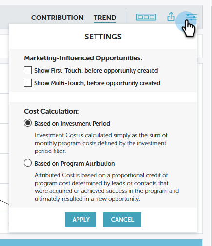

# [!UICONTROL パフォーマンスインサイト]の概要 {#performance-insights-overview}

Marketo の[!UICONTROL パフォーマンスインサイト]は、チャネルの組み合わせを最大限の効果に最適化し、長期的なトレンドを明らかにして、一貫した成功戦略を見つけ出すのに役立ちます。

>[!AVAILABILITY]
>
>必ずしもすべてのお客様がこの機能を購入済みとは限りません。 詳しくは、アドビアカウントチーム（担当のアカウントマネージャー）にお問い合わせください。

[!UICONTROL パフォーマンスインサイト]は、最大過去 24 か月のデータを読み込みます。 これには、現在の年間のデータと前年のデータが含まれます。 例えば、2019年1月31日には、MPIはその月のデータを読み込み、2018年からは毎月データを読み込みます。 2019 年 12 月 31 日に、MPI は 2019 年と 2018 年の毎月のデータを読み込みます。

[!UICONTROL パフォーマンスインサイト]にアクセスするには、分析ホーム画面でパフォーマンスインサイトのアイコンをクリックします。

## 貢献度 {#contribution}

マーケティングの[収入への貢献](/help/marketo/product-docs/reporting/performance-insights/performance-insights-contribution-overview.md)を顧客の獲得、影響、コンバージョン、さらにはインストールされたベースの増加の機能として評価します。

デフォルトでは、表示されるデータは、[!UICONTROL エンゲージメント]別のパフォーマンスを反映しています。 いずれかをクリックするだけで、**[!UICONTROL パイプライン]**&#x200B;または&#x200B;**[!UICONTROL 売上高]**&#x200B;別のパフォーマンスに切り替えることができます。

## トレンド {#trend}

[長期的な動向](/help/marketo/product-docs/reporting/performance-insights/performance-insights-trend-overview.md)を特定して一貫性のある勝者戦略を見つけ出します。

## 設定 {#settings}

[!UICONTROL 売上高]および[!UICONTROL パイプライン]ダッシュボードで、「[[!UICONTROL 設定]](/help/marketo/product-docs/reporting/performance-insights/performance-insights-settings.md)」アイコンをクリックして、追加のパラメーターを設定します。

## データの書き出し {#export-data}

[!DNL PowerPoint] または [!DNL Excel] でデータとグラフを書き出すことができます。 また、[クイックチャート](/help/marketo/product-docs/reporting/performance-insights/performance-insights-quick-charts.md)として保存することもできます。

>[!NOTE]
>
>データを [!DNL Excel] にエクスポートして、（上位 10 件だけでなく）すべてのチャネルで使用できるデータを確認します。 PPT 書き出しは WYSIWYG です（出力は画面に表示される内容を模倣します）。
