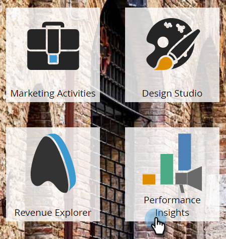
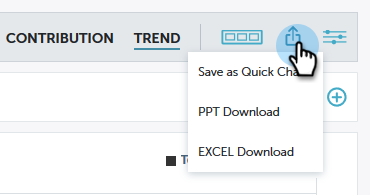

# パフォーマンスインサイトの概要 {#performance-insights-overview}

Marketo のパフォーマンスインサイトは、チャネルの組み合わせを最大限の効果に最適化し、長期的なトレンドを明らかにして、一貫した成功戦略を見つけ出すのに役立ちます。

>[!AVAILABILITY]
>
>必ずしもすべてのお客様がこの機能を購入済みとは限りません。詳しくは、アドビアカウントチーム（担当のアカウントマネージャー）にお問い合わせください。

パフォーマンスインサイトは、最大過去 24 か月のデータを読み込みます。これには、現在の年累計データと、前年のデータが含まれます。例えば、2019 年 1 月 31 日に、MPI はその月のデータを読み込み、2018 年から毎月読み込みます。2019 年 12 月 31 日に、MPI は 2019 年と 2018 年の毎月のデータを読み込みます。

パフォーマンスインサイトにアクセスするには、分析ホーム画面でパフォーマンスインサイトのアイコンをクリックします。

## 貢献度 {#contribution}

マーケティングの[収入への貢献](/help/marketo/product-docs/reporting/performance-insights/performance-insights-contribution-overview.md)を顧客の獲得、影響、コンバージョン、さらにはインストールされたベースの増加の機能として評価します。

デフォルトでは、表示されるデータは、エンゲージメント別のパフォーマンスを反映しています。いずれかをクリックするだけで、パイプラインまたは売上高別のパフォーマンスに切り替えることができます。

## トレンド {#trend}

[長期的な動向](/help/marketo/product-docs/reporting/performance-insights/performance-insights-trend-overview.md)を特定して一貫性のある勝者戦略を見つけ出します。

## 設定 {#settings}

売上高およびパイプラインダッシュボードで、[設定](/help/marketo/product-docs/reporting/performance-insights/performance-insights-settings.md)アイコンをクリックして、追加のパラメーターを設定します。

## データのエクスポート {#export-data}

PowerPoint または Excel でデータとグラフをエクスポートできます。また、[クイックチャート](/help/marketo/product-docs/reporting/performance-insights/performance-insights-quick-charts.md)として保存することもできます。

>[!NOTE]
>
>データを Excel にエクスポートして、（上位 10 件だけでなく）すべてのチャネルで使用できるデータを確認します。PPT 書き出しは WYSIWYG です（出力は画面に表示される内容を模倣します）。
