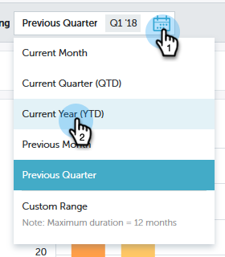
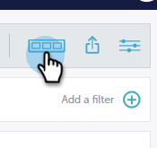

# パフォーマンスインサイトのクイックグラフ {#performance-insights-quick-charts}

クイックグラフは、カスタマイズして保存するサムネールで、最も多く使用するグラフを素早く表示できます。

## 新しいクイックグラフの作成 {#create-a-new-quick-chart}

クイックグラフは、指定したデータから取得されます。この例では、**新しい商談（ファーストタッチ）、商談のタイプとして新しいビジネス、日付として年初から本日**&#x200B;を選択します。

1. 日付フィルターをクリックし、「**現在の年（YTD）**」を選択します。

   

1. 「**+**」をクリックし、条件を選択します。

   

1. 選択したフィルターが反映され、グラフが更新されます。

   

1. 「エクスポート」アイコンをクリックし、「**クイックグラフとして保存**」を選択します。

   

1. クイックグラフに名前を付け、「**保存**」をクリックします。

   

これで、クイックグラフが他のグラフと共に表示されます。

>[!NOTE]
>
>最大 20 個のクイックグラフを使用できます。削除して置き換えることができます。

## 既存のクイックグラフの表示 {#view-existing-quick-charts}

1. 既存のクイックグラフを表示するには、「**クイックグラフ**」アイコンをクリックします。

   

## クイックチャートの削除 {#delete-a-quick-chart}

クイックグラフを削除する必要がある場合は、次の簡単な手順に従います。

1. 「**クイックグラフ**」アイコンをクリックします。

   

1. 目的のグラフにカーソルを置きます。ただし、クリックはしません。カーソルを合わせると、「X」が表示されます。「**X**」をクリックします。

   

1. 「**削除**」をクリックします。

   
