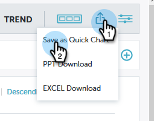

# パフォーマンスインサイトクイックグラフ{#performance-insights-quick-charts}

クイックグラフは、カスタマイズして保存するサムネールで、最もよく使用するグラフの表示をすばやく確認できます。

## 新しいクイックグラフの作成{#create-a-new-quick-chart}

クイックグラフは、指定したデータから派生します。 この例では、次を選択します。**新しいオポチュニティ（ファーストタッチ）、オポチュニティタイプ=新規ビジネス、今年度累計**。

1. 日付フィルターをクリックし、「現在の年(YTD)**」を選択します。**

   

1. **+**&#x200B;をクリックし、条件を選択します。

   

1. グラフは、選択したフィルターを反映して更新されます。

   

1. 書き出しアイコンをクリックし、「**クイックグラフとして保存**」を選択します。

   

1. クイックグラフに名前を付け、[**保存**]をクリックします。

   

クイックグラフが他のグラフと共に表示されます。

>[!NOTE]
>
>クイックグラフは20個まで設定できます。 削除して置き換えることができます。

## 表示の既存のクイックグラフ{#view-existing-quick-charts}

1. 既存のクイックグラフを表示するには、**クイックグラフ**&#x200B;アイコンをクリックします。

   

## クイックグラフの削除{#delete-a-quick-chart}

クイックグラフを削除する必要がある場合は、次の簡単な手順に従います。

1. **クイックグラフ**&#x200B;アイコンをクリックします。

   

1. 目的のグラフの上にマウスポインターを置きますが、クリックしないでください。 カーソルを合わせると、Xが表示されます。 **X**&#x200B;をクリックします。

   

1. 「**削除**」をクリックします。

   

