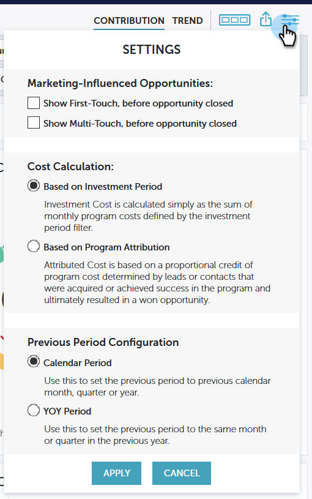

# [!UICONTROL パフォーマンスインサイト]設定 {#performance-insights-settings}

MPI の様々な設定オプションについて説明します。

>[!NOTE]
>
>どのダッシュボードにあるかによって、異なる設定オプションが表示されます。

## プログラムの成功表示基準 {#view-program-success-by}

**[!UICONTROL エンゲージメント]ダッシュボード - 貢献度とトレンド**

<table>
 <tbody>
  <tr>
   <td><strong>原価期間</strong></td>
   <td>これを確認すると、パフォーマンスインサイトはすべての新しい名前と成功を、コスト期間として設定された月まで遡って集計します。</td>
  </tr>
  <tr>
   <td><strong>アクティビティ期間</strong></td>
   <td>これをオンにすると、パフォーマンスインサイトは、プログラムのコスト期間に関係なく、すべての新しい名前、成功、メンバーシップをアクティビティの日付別に集計します。</td>
  </tr>
 </tbody>
</table>

## 前の期間の構成 {#previous-period-configuration}

**[!UICONTROL エンゲージメント]、[!UICONTROL パイプライン]、[!UICONTROL 収益]ダッシュボード - 貢献度のみ**

<table>
 <tbody>
  <tr>
   <td><strong>カレンダー期間</strong></td>
   <td>前の期間を、前の暦月、前の四半期、または前の年に設定します。</td>
  </tr>
  <tr>
   <td><strong>前年比の期間</strong></td>
   <td>前の期間を、同じ月または前の年の同じ四半期に設定します。</td>
  </tr>
 </tbody>
</table>

## マーケティングに影響を受けた商談 {#marketing-influenced-opportunities}

**[!UICONTROL パイプライン]ダッシュボード - 貢献度とトレンド**

<table>
 <tbody>
  <tr>
   <td><strong>商談創出前にファーストタッチを表示</strong></td>
   <td>
これをオンにすると、MPI には、商談が創出される前に Marketo プログラムによって取得された少なくとも 1 つのリード（ファーストタッチ／FT）に関連付けられた商談が含まれます。 「明示」、「暗黙」、「ハイブリッド」の各アトリビューション設定を適用できます。
</td>
  </tr>
  <tr>
   <td><strong>商談が創出される前にマルチタッチを表示</strong></td>
   <td>
これをオンにすると、MPI には、商談が創出される前に Marketo プログラムによって取得された少なくとも 1 つのリード（マルチタッチ／MT）を持つ商談が含まれます。 「明示」、「暗黙」、「ハイブリッド」の各アトリビューション設定を適用できます。
</td>
  </tr>
 </tbody>
</table>

**[!UICONTROL 収益]ダッシュボード - 貢献度とトレンド**

<table>
 <tbody>
  <tr>
   <td><strong>商談クローズ前にファーストタッチを表示</strong></td>
   <td>
これをオンにすると、MPI には、商談がクローズされる前に Marketo プログラムによって取得された少なくとも 1 つのリード（ファーストタッチ／FT）に関連付けられた商談が含まれます。 「明示」、「暗黙」、「ハイブリッド」の各アトリビューション設定を適用できます。
</td>
  </tr>
  <tr>
   <td><strong>商談がクローズされる前にマルチタッチを表示</strong></td>
   <td>
これをオンにすると、MPI には、商談がクローズされる前に Marketo プログラムによって取得された少なくとも 1 つのリード（マルチタッチ／MT）を持つ商談が含まれます。 「明示」、「暗黙」、「ハイブリッド」の各アトリビューション設定を適用できます。
</td>
  </tr>
 </tbody>
</table>

## コスト計算 {#cost-calculation}

**[!UICONTROL パイプライン]および[!UICONTROL 収益]ダッシュボード - 貢献度とトレンド**

<table>
 <tbody>
  <tr>
   <td><strong>投資期間ベース</strong></td>
   <td>投資コストは、投資期間フィルターによって定義される毎月のプログラムコストの単純な合計です。</td>
  </tr>
  <tr>
   <td><strong>プログラム属性ベース</strong></td>
   <td>属性コストは、プログラムコストの一部であり、リードの獲得またはプログラムの成功により最終的に商談の獲得をもたらした連絡先の数で決まります。</td>
  </tr>
 </tbody>
</table>
