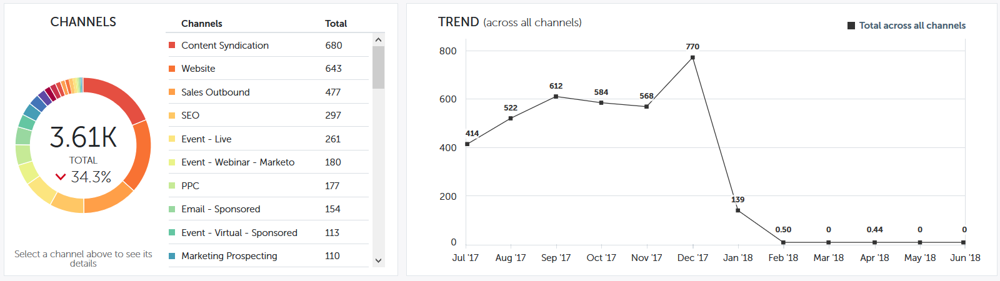
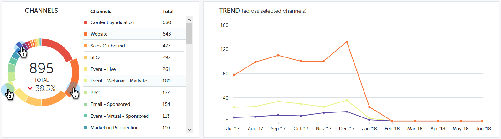

# [!UICONTROL パフォーマンスインサイト]のトレンドの概要 {#performance-insights-trend-overview}

[!UICONTROL トレンド]は、ある期間のチャネルパフォーマンスを示します。

「**[!UICONTROL トレンド]**」タブをクリックして、この表示にアクセスします。

## [!UICONTROL トレンド] {#trend}

パフォーマンスを表示する指標を選択します。

指標は、ドーナツグラフと折れ線グラフで表示されます。

ドーナツグラフには、選択した指標の上位 10 チャネルが表示されます。

折れ線グラフには、過去 12 か月間に選択した指標のチャネルパフォーマンスのトレンドが表示されます。

1 つ以上のチャネルを選択すると、チャネルのトレンドが折れ線グラフに表示されます。 選択を解除するには、チャネルをもう一度クリックします。

以下のデータグリッドは、スプレッドシートのように機能し、過去 12 か月間に選択した指標で使用可能なすべてのトレンドデータを示します。

チャネルを展開して、上位 10 件のプログラムと残りのプログラムを組み合わせます。

>[!NOTE]
>
>チャネルの横にあるチェックボックスをクリックすると、ドーナツグラフでチャネルがアクティブ／非アクティブになります。
