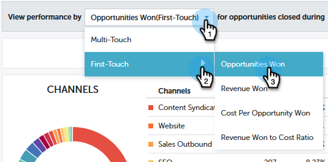

# パフォーマンスインサイトトレンドの概要 {#performance-insights-trend-overview}

トレンドには、ある期間のチャネルのパフォーマンスが表示されます。

「 **トレンド** 」タブをクリックして、この表示にアクセスします。

## トレンド {#trend}

パフォーマンスを表示する指標を選択します。 この例では、 [ファーストタッチで獲得したオポチュニティを見てみます](http://docs.marketo.com/display/DOCS/Understanding+Attribution)。

指標は次の2つのグラフで表示されます。ドーナツと線。

選択した指標の上位10チャネルがドーナツグラフに表示されます。

折れ線グラフには、過去12か月間に選択した指標のチャネルパフォーマンスのトレンドが表示されます。

1つ以上のチャネルを選択すると、折れ線グラフにチャネルのトレンドが表示されます。 チャネルをもう一度クリックして選択を解除します。

下のデータグリッドはスプレッドシートのように機能し、過去12か月間に選択した指標で使用可能なすべてのトレンドデータを表示します。

チャネルを展開すると、上位10プログラム、残りのプログラムを組み合わせて表示できます。

>[!NOTE]
>
>チャネルの横にあるチェックボックスをクリックすると、ドーナツグラフ内でドーナツグラフがアクティブ/非アクティブになります。

