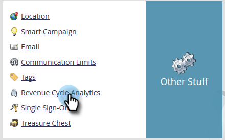
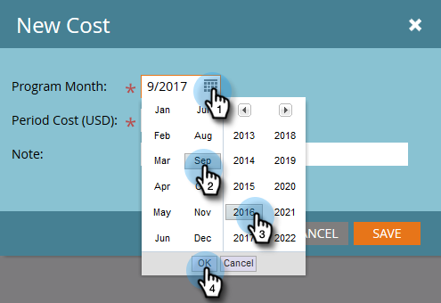
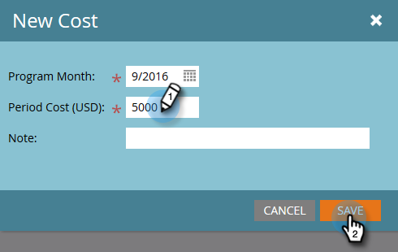
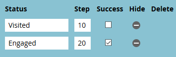

# パフォーマンスインサイトの設定 {#setting-up-performance-insights}

以下の手順に従って MPI を設定します。

## 商談の設定 {#opportunity-setup}

1. 「**管理者**」をクリックします。

   

1. 「**収益サイクルアナリティクス**」をクリックします。

   

   >[!NOTE]
   >
   >収益サイクルアナリティクスがない場合は、手順 2 で「**プログラム分析**」を選択する必要があります。

1. 「属性」で、「**編集**」をクリックします。

   

1. 「属性設定」が表示されます。

   

   属性が明示的な場合は、（商談の役割エンドポイントまたは CRM 統合を介して）商談連絡先の役割が設定されていることを確認します。

   属性が暗黙的な場合は、リード／連絡先の会社フィールドが商談の顧客名と同じであることを確認します。

   >[!NOTE]
   >
   >すべての商談に次の適切なフィールドが設定されていることを確認します。
   >
   >* 商談額
   >* クローズ済み
   >* 獲得済み
   >* 作成日（お客様の場合は設定できません）
   >* クローズ日（お客様の場合は設定できません）
   >* 商談のタイプ

## プログラムセットアップ {#program-setup}

少なくとも 12 か月間、プログラムのコストを更新します。これは、手動で実行するか、プログラム API を使用して実行できます。この例では、手動でおこないます。

1. 「**マーケティングアクティビティ**」をクリックします。

   

1. プログラムを選択します。

   

1. 「**設定**」タブをクリックします。

   

1. **期間原価**&#x200B;をキャンバスにドラッグします。

   

1. 12 か月以上前にプログラムの月を設定し、「**Ok**」をクリックします。

   

1. 期間原価を設定し、「**保存**」をクリックします。

   

次に、分析動作をレビューして、特定のチャネルを分析に含める必要があるかどうかを示します。分析動作（標準、包括的、運用可能）を設定します。

1. 「**管理者**」をクリックします。

   

1. 「**タグ**」をクリックします。

   

1. 「**+**」をクリックして、チャネルリストを展開します。

   

1. 目的のチャネルをダブルクリックします。

   

1. **分析動作**&#x200B;ドロップダウンをクリックして、目的の動作を選択します。

   

1. 達成基準を設定します。

   

1. 「**保存**」をクリックします。

   

## プログラムをリードに結び付ける {#tie-the-program-to-the-person}

1. ファーストタッチ属性を機能させるために、データベース内の各ユーザーに対して獲得プログラムと獲得日が設定されていることを確認します。
1. プログラムで、顧客の成功状態が設定されていることを確認します。

>[!NOTE]
>
>変更は即時にはおこなわれません。変更が有効になる前には一晩が必要です。
