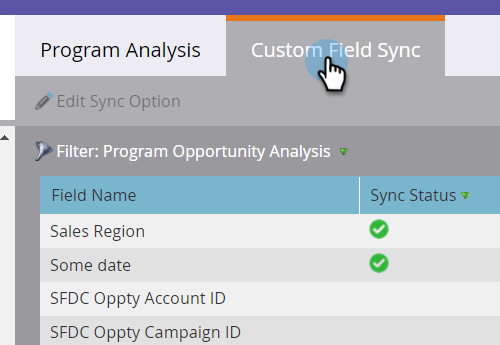
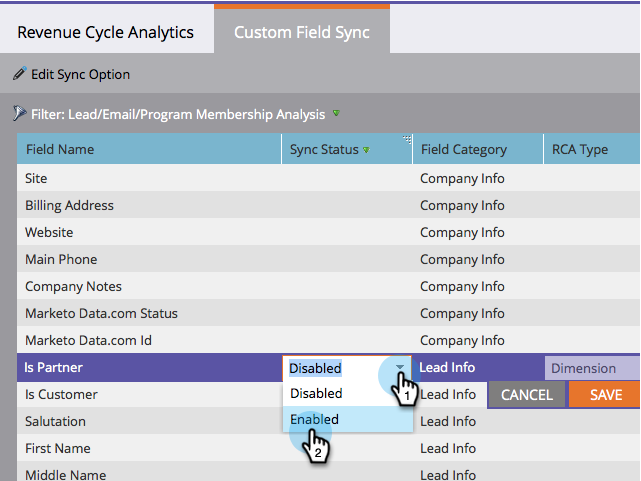

# カスタムフィールドをパフォーマンスインサイトに同期 {#sync-custom-fields-to-performance-insights}

MPI 売上高およびパイプラインダッシュボードは、カスタム Marketo フィールドでフィルタリングできます。そのためには、同期するカスタムフィールドを設定する必要があります。

>[!NOTE]
>
>**管理者権限が必要**

>[!NOTE]
>
>この記事は、売上高サイクル分析（RCA）を&#x200B;**持っていない**&#x200B;ユーザー専用です。RCA がある場合は、[この記事](/help/marketo/product-docs/reporting/revenue-cycle-analytics/revenue-explorer/sync-custom-fields-to-the-revenue-explorer.md)の手順に従ってください。

1. **管理**&#x200B;セクションに移動します。

   

1. 「その他」の下の「**プログラム分析**」を選択します。

   

1. 「**カスタムフィールド同期**」タブをクリックします。

   

1. 同期を有効にするフィールドを選択し、「**同期オプションを編集**」をクリックします。

   

1. 「**同期ステータス**」を「**有効**」に変更します。

   

1. 任意の「**RCA タイプ**」を選択し、「**保存**」をクリックします。

   

   >[!NOTE]
   >
   >有効にすると、次の日に MPI でフィールドが使用可能になります。
