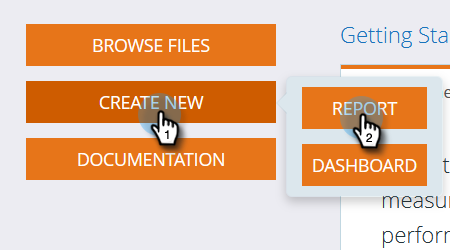
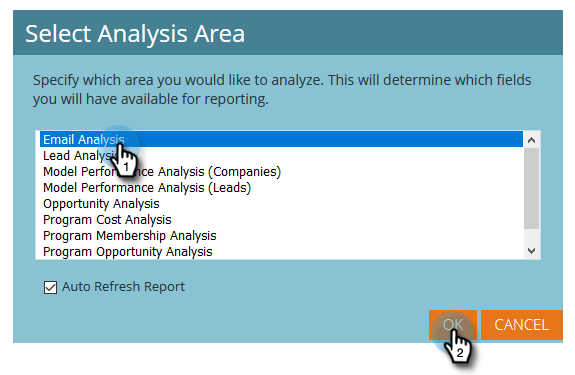
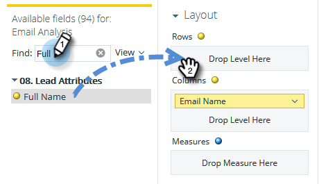

# リードを一覧表示するメール分析レポートの作成 {#build-an-email-analysis-report-that-lists-leads}

特定のメールを送信したリードがすべて表示されるメール分析レポートを作成するには、以下の手順に従います。このレポートには、クリックと開封の統計も含まれます。

>[!AVAILABILITY]
>
>必ずしもすべてのお客様がこの機能を購入済みとは限りません。 詳しくは、アドビアカウントチーム（担当のアカウントマネージャー）にお問い合わせください。

>[!NOTE]
>
>メール分析 RCA をサポートするデータエンジンは、同じメールとキャンペーンからのクリックが 1 人あたり 12 回を超えると無視します。 メール分析レポートを標準の Marketo Analytics レポートと比較する場合は、この点を考慮してください。

1. **[!UICONTROL 収益エクスプローラ]**&#x200B;を起動します。

   

1. 「**[!UICONTROL 新規作成]**」をクリックし、「**[!UICONTROL レポート]**」をクリックします。

   

1. 「**[!UICONTROL メール分析]**」を選択し、「**[!UICONTROL OK]**」をクリックします。

   

1. 黄色ドットが付いた「**[!UICONTROL メール名]**」を探し、右クリックして「**[!UICONTROL フィルター...]**」を選択します。

   

1. リストから選択したメールをダブルクリックし、「**[!UICONTROL OK]**」をクリックします。

   

1. 黄色いドットが付いた「**[!UICONTROL メール名]**」を&#x200B;**[!UICONTROL 列]**&#x200B;にドラッグします。

   

   >[!TIP]
   >
   >列として追加できるリード／会社属性は多数あるので、確認してみてください。

1. 黄色いドットが付いた「**[!UICONTROL 氏名]**」を探し、**[!UICONTROL 行]**&#x200B;にドラッグします。

   

1. 次に、目的の「**[!UICONTROL 測定]**」をダブルクリックして追加します。

   

>[!NOTE]
>
>このレポートのデータ量によっては、更新に時間がかかる場合があります。

これで完了です。
