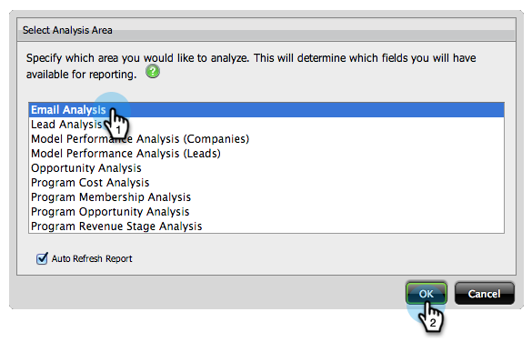

# リストがリードする電子メール分析レポートの作成 {#build-an-email-analysis-report-that-lists-leads}

>[!NOTE]
>
>**可用性**
>
>この機能を購入していないお客様もいます。 詳細については、セールス担当者にお問い合わせください。

次の手順に従って、特定の電子メールを送信したすべてのリードを表示する電子メール分析レポートを作成します。このレポートには、クリックと開く統計も含まれます。 1.売上高エクスプローラを起動します。

1. [新しいレポート]をクリックします。

   

1. 「電子メール分析」領域を選択し、「OK」をクリックします。

   

1. 「電子メール名」の黄色い点を探し、右クリックして「フィルター」を選択します。

   

1. 重複がリストから選択した電子メールをクリックし、「OK」をクリックします。

   

1. 「電子メール名」の黄色い点を「列」にドラッグします。

   

   >[!TIP]
   >
   >リード/会社属性は、列として追加できるものが多数あり、それらを調べてください。

1. フルネームの黄色い点を探し、「行」にドラッグします。

   

1. 次に、重複が目的のメジャーをクリックして追加します。

   

>[!NOTE]
>
>このレポートに含まれるデータの量によっては、更新に時間がかかる場合があります。

これで、レポートは次のようになります。   

任務完了！
