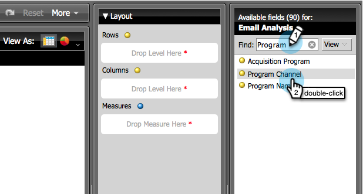

# プログラム情報を示すメール分析レポートの作成 {#build-an-email-analysis-report-that-shows-program-information}

プログラムチャネルごとにグループ化されたメール情報を表示するメール分析レポートを作成するには、以下の手順に従います。

>[!AVAILABILITY]
>
>すべてのお客様がこの機能を購入しているわけではありません。詳細は、セールス担当者にお問い合わせください。

1. **収益エクスプローラー**&#x200B;を起動します。

   

1. 「**新規レポート**」をクリックします。

   

1. **メール分析**&#x200B;領域を選択し、「**OK**」をクリックします。

   

1. **送信済み（週）**&#x200B;の黄色い点をみつけて、右クリックします。「**フィルター**」をクリックします。

   >[!NOTE]
   >
   >これにより、レポートの期間が絞り込まれます。

   

1. 「**現在の送信済み週**」にチェックを入れて、「**OK**」をクリックします。

   

1. **プログラムチャネル**&#x200B;の黄色い点をみつけて、ダブルクリックします。

   

1. **メール名**&#x200B;の黄色い点をみつけて、ダブルクリックします。

   

1. **送信済み**、**開封済み**、**クリック済み**&#x200B;の青い点をみつけて、ダブルクリックします。

   

   完成です。レポートは次のようになります。

   
