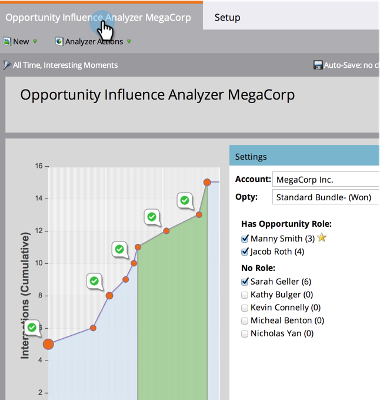

# 商談の影響アナライザーの設定 {#configure-an-opportunity-influence-analyzer}

[商談の影響アナライザーを作成](/help/marketo/product-docs/reporting/revenue-cycle-analytics/opportunity-influence-analyzer/create-an-opportunity-influence-analyzer.md)すると、対象にする[注目のアクション](/help/marketo/product-docs/marketo-sales-insight/msi-for-salesforce/features/tabs-in-the-msi-panel/interesting-moments/interesting-moments-overview.md)のタイプを設定できます。

>[!PREREQUISITES]
>
>[商談の影響アナライザーの作成](/help/marketo/product-docs/reporting/revenue-cycle-analytics/opportunity-influence-analyzer/create-an-opportunity-influence-analyzer.md)

1. 「**分析**」をクリックします。

   

1. 分析に移動し、「商談の影響アナライザー」を選択します。

   

   アナライザーグラフに注目のアクションが多すぎる場合は、**設定**&#x200B;パネルで人を選択解除するか、注目のアクションのタイプを減らすことで、注目のアクション数を減らすことができます。

1. 含める対象のモーメントのタイプを設定するには、「設定」タブに移動し、対象の「注目のアクション」フィルターをドラッグします。

   

1. 「すべて表示」、「なし」、「一部」のいずれかを選択します。

   

1. 「一部」を選択した場合は、含めるタイプを選択できます。

   

1. 必要な注目のアクションのタイプをそれぞれクリックしてから、「**保存**」をクリックします。

1. メインのタブをクリックすると、選択したタイプの注目のアクションのみで商談の履歴が表示されます。

   

>[!MORELIKETHIS]
>
>[商談の影響アナライザーでマーケティング事例を伝える](/help/marketo/product-docs/reporting/revenue-cycle-analytics/opportunity-influence-analyzer/tell-the-marketing-story-with-an-opportunity-influence-analyzer.md)
