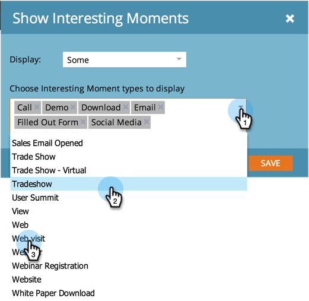
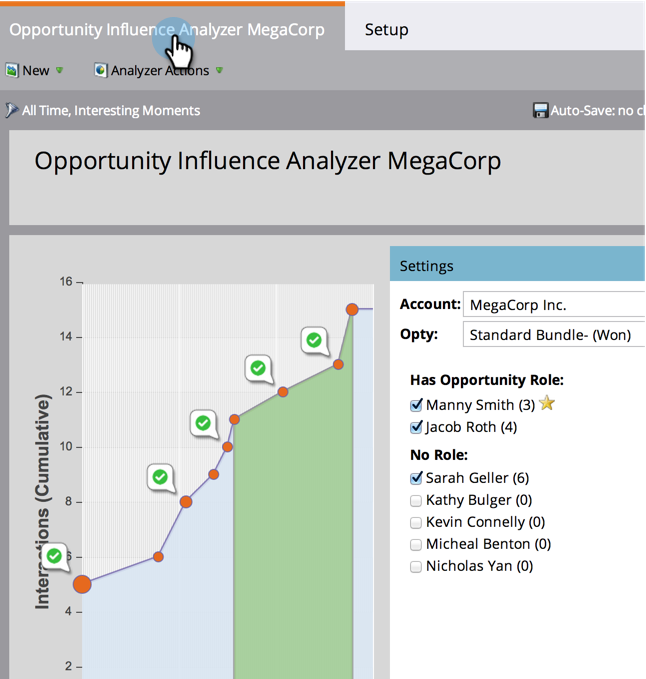

# 商談の影響分析の設定 {#configure-an-opportunity-influence-analyzer}

[商談の影響分析を作成](/help/marketo/product-docs/reporting/revenue-cycle-analytics/opportunity-influence-analyzer/create-an-opportunity-influence-analyzer.md)すると、対象にする[注目のアクション](/help/marketo/product-docs/marketo-sales-insight/msi-for-salesforce/features/tabs-in-the-msi-panel/interesting-moments/interesting-moments-overview.md)のタイプを設定できます。

>[!PREREQUISITES]
>
>[商談の影響分析の作成](/help/marketo/product-docs/reporting/revenue-cycle-analytics/opportunity-influence-analyzer/create-an-opportunity-influence-analyzer.md)

1. 「**[!UICONTROL 分析]**」をクリックします。

   

1. **[!UICONTROL 分析]**&#x200B;に移動し、「商談の影響分析」を選択します。

   

   アナライザーグラフに注目のアクションが多すぎる場合は、**[!UICONTROL 設定]**&#x200B;パネルで人物を選択解除するか、注目のアクションのタイプを減らすことで、注目のアクション数を減らすことができます。

1. 含める注目のアクションのタイプを設定するには、「**[!UICONTROL 設定]**」タブに移動し、対象の「**[!UICONTROL 注目のアクション]**」フィルターをドラッグします。

   

1. 「**[!UICONTROL すべて]**」、「**[!UICONTROL なし]**」、「**[!UICONTROL 一部]**」の表示のいずれかを選択します。

   

1. 「**[!UICONTROL 一部]**」を選択した場合は、含めるタイプを選択できます。

   

1. 必要な注目のアクションのタイプをそれぞれクリックしてから、 「**[!UICONTROL 保存]**」をクリックします。

1. メインのタブをクリックすると、選択したタイプの注目のアクションのみで商談の履歴が表示されます。

   

>[!MORELIKETHIS]
>
>[商談の影響分析でマーケティング事例を伝える](/help/marketo/product-docs/reporting/revenue-cycle-analytics/opportunity-influence-analyzer/tell-the-marketing-story-with-an-opportunity-influence-analyzer.md)
