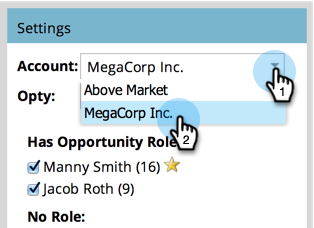
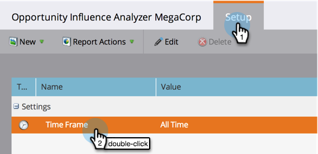
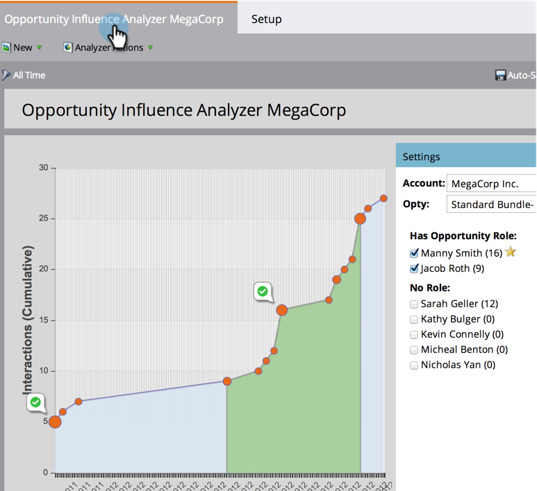

# 商談の影響分析の作成 {#create-an-opportunity-influence-analyzer}

商談の影響分析を使用して、重要な案件に対するマーケティングの貢献度を表示します。商談の期間の中で、プログラムやイベントの成功、および興味深い瞬間を確認できます。

>[!NOTE]
>
>商談の影響分析から優れたインテルを取得するには、連絡先が CRM の商談に付随していることを確認します。

1. 「**[!UICONTROL 分析]**」をクリックします。

   

1. 「**[!UICONTROL 商談の影響分析]**」をクリックします。

   

1. **[!UICONTROL 設定]**&#x200B;パネルから顧客を選択します。

   

   >[!NOTE]
   >
   >期間中にアクティビティがなかったという警告が表示された場合は、「**[!UICONTROL 閉じる]**」をクリックします。この話には次の手順の後に戻ります。

1. その顧客で商談を選択します。

   

1. 期間を設定します。「**[!UICONTROL セットアップ]**」タブをクリックし、「**[!UICONTROL 時間枠]**」をダブルクリックします。

   

1. 分析する商談の期間を選択し、「**[!UICONTROL 保存]**」をクリックします。

   

   >[!TIP]
   >
   >
   >ほとんどの場合、**[!UICONTROL 全期間]**&#x200B;が最も単純な選択です。

1. レポートが表示されました。メインタブをクリックして、商談に関わる興味深い瞬間と成功を確認します。

   

>[!TIP]
>
>また、[Marketo 大学](https://learn.marketo.com)で、商談の影響分析に関するビデオを見ることもできます（今は少し違うように見えますが、まだ学ぶことが多いです）。

>[!MORELIKETHIS]
>
>* [商談の影響分析でマーケティング事例を伝える](/help/marketo/product-docs/reporting/revenue-cycle-analytics/opportunity-influence-analyzer/tell-the-marketing-story-with-an-opportunity-influence-analyzer.md)
>* [商談の影響分析の設定](/help/marketo/product-docs/reporting/revenue-cycle-analytics/opportunity-influence-analyzer/configure-an-opportunity-influence-analyzer.md)
