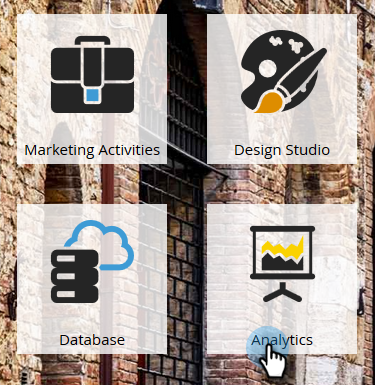
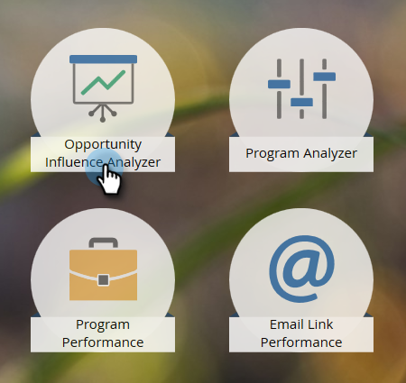
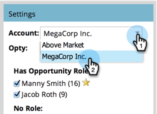
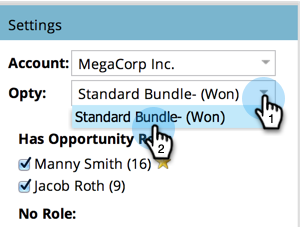
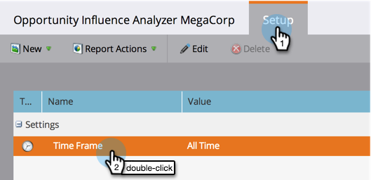
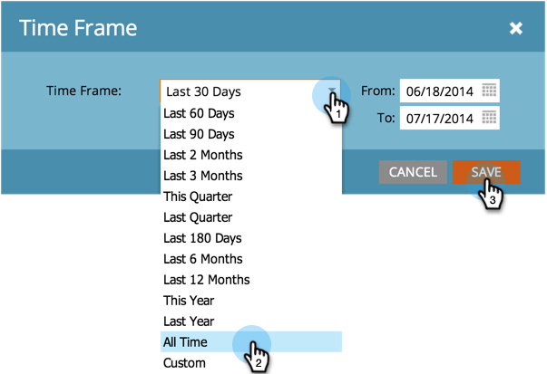
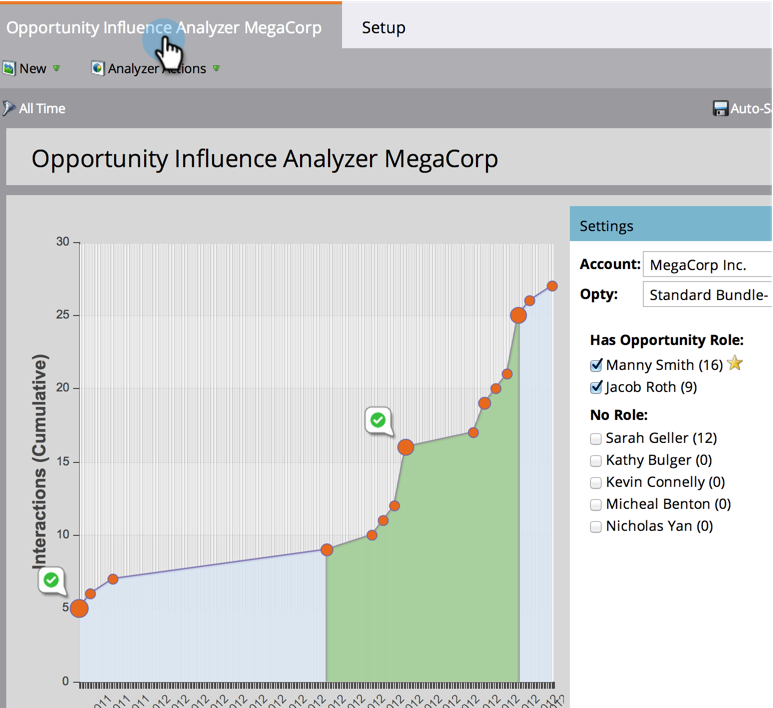

# 商談の影響アナライザーの作成&#x200B; {#create-an-opportunity-influence-analyzer}

商談の影響アナライザーを使用して、重要な商談に対するマーケティングの貢献度を表示します。 商談のライフサイクルの中で、プログラムやイベントの成功、および注目のアクションを確認できます。

>[!NOTE]
>
>商談の影響アナライザーから有益な情報を得るには、取引先責任者が CRM の商談に関連付けられていることを確認します。

1. 「**[!UICONTROL 分析]**」をクリックします。

   

1. 「**[!UICONTROL 商談の影響分析]**」をクリックします。

   

1. **[!UICONTROL 設定]**&#x200B;パネルから顧客を選択します。

   

   >[!NOTE]
   >
   >期間中にアクティビティがなかったという警告が表示された場合は、「**[!UICONTROL 閉じる]**」をクリックします。 この話には次の手順の後に戻ります。

1. そのアカウント内で商談を選択します。

   

1. 期間を設定します。 「**[!UICONTROL セットアップ]**」タブをクリックし、「**[!UICONTROL 時間枠]**」をダブルクリックします。

   

1. 分析する商談の期間を選択し、「**[!UICONTROL 保存]**」をクリックします。

   

   >[!TIP]
   >
   >
   >ほとんどの場合、**[!UICONTROL 全期間]**&#x200B;が最も単純な選択です。

1. キミはそこにいる！ メインタブをクリックして、商談に関わる注目のアクションと成功を確認します。

   

>[!TIP]
>
>また、[Marketo 大学](https://learn.marketo.com)で、商談の影響分析に関するビデオを見ることもできます （今は少し変わって見えますが、まだまだ学ぶべきことはたくさんあります。）

>[!MORELIKETHIS]
>
>* [商談の影響分析でマーケティング事例を伝える](/help/marketo/product-docs/reporting/revenue-cycle-analytics/opportunity-influence-analyzer/tell-the-marketing-story-with-an-opportunity-influence-analyzer.md)
>* [商談の影響分析の設定](/help/marketo/product-docs/reporting/revenue-cycle-analytics/opportunity-influence-analyzer/configure-an-opportunity-influence-analyzer.md)
