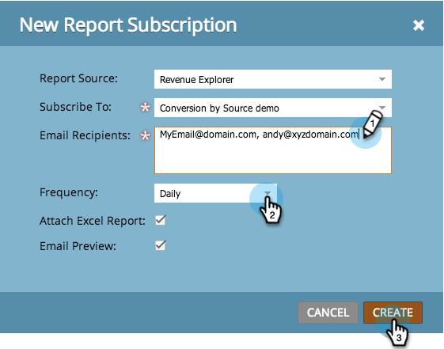
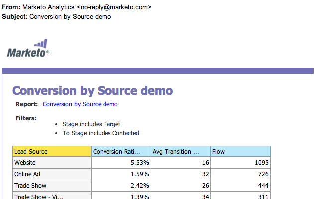

# 商談の影響分析のデータのエクスポート {#export-opportunity-influence-analyzer-data}

収益サイクルエクスプローラーのレポートの更新を受け取り、共有できるようにするには、既存のレポートに任意のメールアドレスを購読します。

1. **[!UICONTROL 分析]**&#x200B;に移動し、**[!UICONTROL 新規]**／**[!UICONTROL 新規レポートの配信登録]**&#x200B;を選択します。

   

   >[!NOTE]
   >
   >プログラムで作成した基本レポートを配信登録するには、「[基本レポートの配信登録](/help/marketo/product-docs/reporting/basic-reporting/report-subscriptions/subscribe-to-a-basic-report.md)」を参照してください。

1. 「**[!UICONTROL レポートソース]**」で、「**[!UICONTROL 収益エクスプローラー]**」を選択します。

   

1. フォルダーツリーに移動し、レポートを選択します。

   

1. メールアドレスを入力し、レポートメールの頻度を設定します。

   

   >[!NOTE]
   >
   >レポートの購読解除は、受信したメールから誰でも行うことができます。

1. 配信登録が設定されました。 自分自身のメールアドレスを追加した場合は、レポートメールが届きます。

   

>[!MORELIKETHIS]
>
>1 か所で[レポートの配信登録をすべて管理する](/help/marketo/product-docs/reporting/basic-reporting/report-subscriptions/manage-report-subscriptions.md)方法を参照してください。
