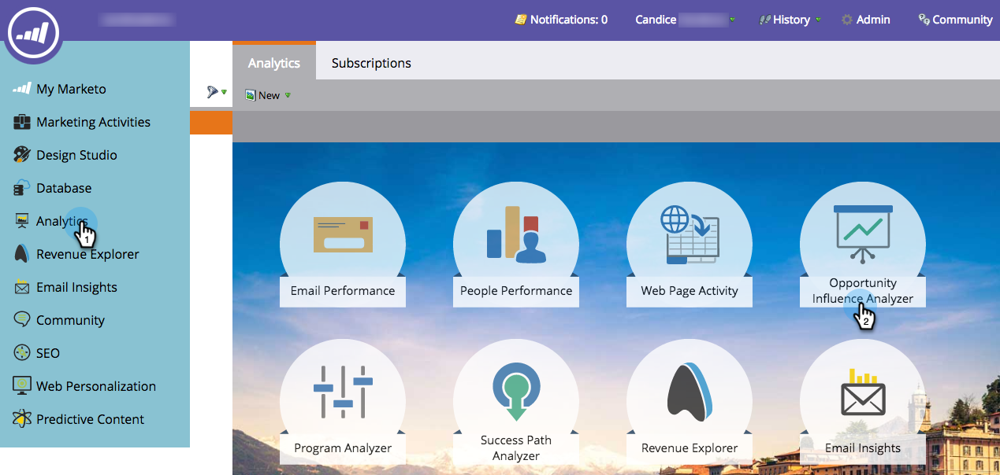

# 商談の影響アナライザーでマーケティング事例を伝える {#tell-the-marketing-story-with-an-opportunity-influence-analyzer}

商談の影響アナライザーを使用して、重要な商談に対するマーケティングの役割を説明します。マーケティングが、ファーストタッチから商談の創出や成立、その他の機会にどのように影響したのかを示します。

>[!PREREQUISITES]
>
>[商談の影響アナライザーの作成](/help/marketo/product-docs/reporting/revenue-cycle-analytics/opportunity-influence-analyzer/create-an-opportunity-influence-analyzer.md)

1. **分析**&#x200B;に移動し、「**商談の影響アナライザー**」を選択します。

   

   商談の影響アナライザーは、その商談に関わるインタラクションやプログラム、イベントの成功を視覚的に表現したものです。グラフを参照してみましょう。

   *  **オレンジ色のドット**&#x200B;は、商談の中の注目のアクションを表します（電子メールの開封、展示会への訪問、ホワイトペーパーのダウンロードなど）。ドットが大きいほど、インタラクションが多くなります。

   *  **バインダーアイコン**&#x200B;は、プログラムの成功を示します。

   *  **カレンダーアイコン**&#x200B;は、イベントの成功を示します。

   * **商談期間**。緑の領域は、商談の創出から商談のクローズ（成立または不成立）まで、商談自体を表します。

   * **商談のライフサイクル**。緑色の商談期間の前後の灰色の領域に、商談に導いたインタラクションとその後のインタラクションが表示されます。

   **設定**&#x200B;パネルには、アカウントのリードが一覧表示されます。

   * **括弧内の数**&#x200B;は、その連絡先とのインタラクション数です。

   *  **黄色の星**&#x200B;は、メインの連絡先を示します。

1. 名前の上にカーソルを置くと、その人の肩書きと商談に関与したソースが表示されます。

   

1. その人のインタラクションをグラフに含めるには、このチェックボックスを選択します。

   

   商談でのインタラクションが表示されるようにグラフが自動調整されます。この例では、MegaCorp の CEO である Sarah Geller 氏がこの商談に深く関わっていることがすぐにわかります。ただし、この商談に関する同氏の役割は CRM に割り当てられていませんでした。

1. オレンジ色のドットをクリックすると、インタラクションの詳細が表示されます。

   

   この例では、CEO の Sarah Geller 氏が web サイトを複数回訪問し、ブログを購読したことがわかります。これは、MegaCorp のこの商談の中の関心が、マーケティングプログラムやアセットによって大きく動かされたことを示しています。

   タイムラインに沿ってオレンジ色のドットをクリックして、商談を創出し、クローズに役立ったイベント、プログラム、注目のアクションのストーリーを埋めていきます。

   >[!MORELIKETHIS]
   >
   >[商談の影響アナライザーの設定](/help/marketo/product-docs/reporting/revenue-cycle-analytics/opportunity-influence-analyzer/configure-an-opportunity-influence-analyzer.md)
