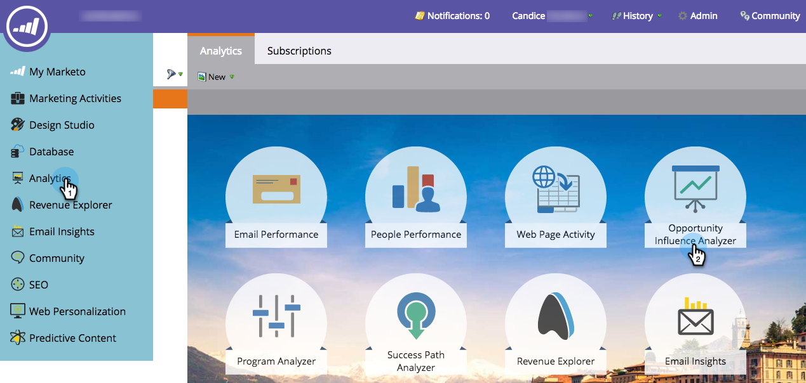
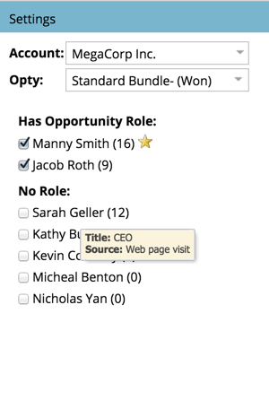
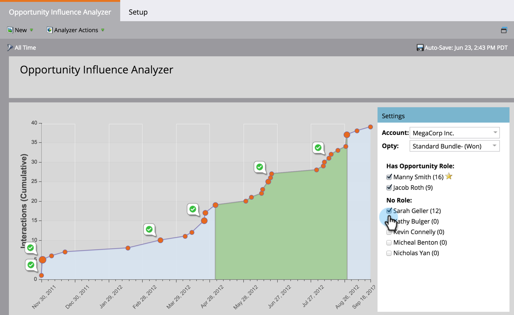
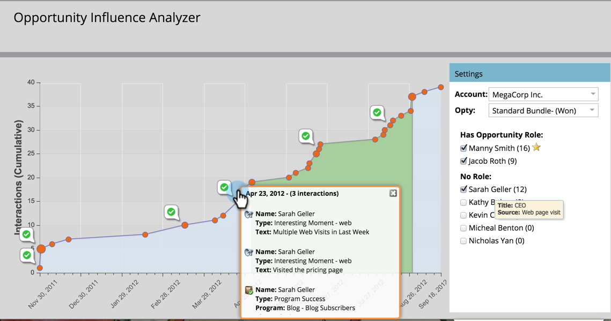

# [!UICONTROL 商談の影響分析]でマーケティング事例を伝える {#tell-the-marketing-story-with-an-opportunity-influence-analyzer}

[!UICONTROL 商談の影響分析]を使用して、重要な商談に対するマーケティングの役割を説明します。 ファーストタッチから商談の作成、成約、そしてその先まで、マーケティングが商談にどのように影響したかを示します。

>[!PREREQUISITES]
>
>[[!UICONTROL 商談の影響分析]](/help/marketo/product-docs/reporting/revenue-cycle-analytics/opportunity-influence-analyzer/create-an-opportunity-influence-analyzer.md)の作成

1. **[!UICONTROL 分析]**&#x200B;に移動し、「**[!UICONTROL 商談の影響分析]**」を選択します。

   

   [!UICONTROL 商談の影響分析]は、その商談に関わるインタラクションやプログラム、イベントの成功を視覚的に表現したものです。 グラフを参照してみましょう。

   *  **オレンジ色のドット**&#x200B;は、商談の中の注目のアクションを表します（メールの開封、展示会への訪問、ホワイトペーパーのダウンロードなど）。 ドットが大きいほど、インタラクションが多くなります。

   *  **バインダーアイコン**&#x200B;は、プログラムの成功を示します。

   *  **カレンダーアイコン**&#x200B;は、イベントの成功を示します。

   * **商談期間**。 緑色の領域は、商談の作成から商談のクローズ（成約または不成約）まで、商談自体を表します。

   * **商談のライフサイクル**。 緑色の商談期間の前後の灰色の領域には、商談につながったインタラクションと、その後のインタラクションが表示されます。

   **[!UICONTROL 設定]**&#x200B;パネルには、アカウントのリードが一覧表示されます。

   * **括弧内の数**&#x200B;は、その連絡先とのインタラクション数です。

   *  **黄色の星**&#x200B;は、メインの連絡先を示します。

1. 名前にポインタを合わせると、その人物の役職と、商談への関与のきっかけが表示されます。

   

1. その人のインタラクションをグラフに含めるには、このチェックボックスを選択します。

   

   商談でのインタラクションが表示されるようにグラフが自動調整されます。 この例では、MegaCorp の CEO である Sarah Geller 氏がこの商談に深く関わっていることがすぐにわかります。ただし、この商談に関する同氏の役割は CRM に割り当てられていませんでした。

1. オレンジ色のドットをクリックすると、インタラクションの詳細が表示されます。

   

   この例では、CEO の Sarah Geller 氏が web サイトを複数回訪問し、さらにはブログを購読したことがわかります。 これは、MegaCorp のこの商談の中の関心が、マーケティングプログラムやアセットによって大きく動かされたことを示しています。

   タイムラインに沿ってオレンジ色のドットをさらにクリックし、商談の創出とクローズに役立ったイベント、プログラム、注目のアクションから成るストーリーを描き出します。

   >[!MORELIKETHIS]
   >
   >[[!UICONTROL 商談の影響分析]](/help/marketo/product-docs/reporting/revenue-cycle-analytics/opportunity-influence-analyzer/configure-an-opportunity-influence-analyzer.md)の設定
