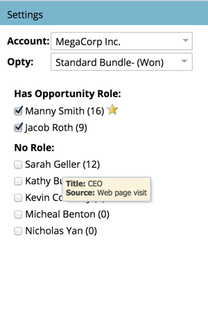

# オポチュニティへの影響分析{#tell-the-marketing-story-with-an-opportunity-influence-analyzer}でマーケティングの話をする

Opportunity Influence Analyzerを使用して、重要なオポチュニティにおけるマーケティングの役割を示します。 ファーストタッチからオポチュニティの作成や勝利、その他に、マーケティングがオポチュニティにどのような影響を与えたかを示します。

>[!PREREQUISITES]
>
>[オポチュニティ影響分析計の作成](/help/marketo/product-docs/reporting/revenue-cycle-analytics/opportunity-influence-analyzer/create-an-opportunity-influence-analyzer.md)

1. **Analytics**&#x200B;に移動し、**オポチュニティの影響分析**&#x200B;を選択します。

   

   Opportunity Influence Analyzerは、そのオポチュニティに関与するインタラクション、プログラム、イベントの成功を視覚的に表したものです。 グラフを見てみましょう。

   *  **オレンジ色の** ドットは、オポチュニティの中で興味深い瞬間を表します（電子メールの開封、トレードショーの訪問、ホワイトペーパーのダウンロードなど）。大きい点は、より多くの相互作用を示します。

   *  **バインダー** アイコンはプログラムの成功を示します。

   *  **カレンダー** アイコンはイベントの成功を示します。

   * **商談期間**。緑色の領域は、オポチュニティの作成からオポチュニティのクローズ（勝者または敗者）まで、オポチュニティ自体を表します。

   * **オポチュニティのライフサイクル**。緑色のオポチュニティ期間の前後の灰色の領域には、オポチュニティに導いたり、オポチュニティに従ったインタラクションが表示されます。

   **設定**&#x200B;パネルには、アカウントのユーザーがリストされます。

   * 括弧&#x200B;**内の**&#x200B;数字は、その連絡先との対話数です。

   * 黄色 **の** 星は主接触を示します。

1. 名前の上にマウスポインターを置くと、その人の肩書とオポチュニティとの関与源が表示されます。

   

1. その人のインタラクションをグラフに含める場合は、チェックボックスを選択します。

   

   グラフは、オポチュニティ内でのインタラクションを表示するように自動調整されます。 この例では、MegaCorpのCEOであるSarah Gellerがこの機会に深く関与していることがすぐにわかります。ただし、この機会にCRMに割り当てられていないSarah Gellerも関与しています。

1. インタラクションの詳細を表示するには、オレンジ色の点をクリックします。

   

   この例では、CEOのSarah GellerがWebサイトを何度も訪問し、ブログを購読していることがわかります。 これは、MegaCorpがこの機会に対する関心を、大部分はマーケティングプログラムや資産によって引き起こしたことを示している。

   タイムライン上のオレンジ色の点をクリックして、オポチュニティの作成と終了に役立ったイベント、プログラム、おもしろい瞬間のストーリーを埋めます。

   >[!MORELIKETHIS]
   >
   >[オポチュニティ影響分析計の構成](/help/marketo/product-docs/reporting/revenue-cycle-analytics/opportunity-influence-analyzer/configure-an-opportunity-influence-analyzer.md)
