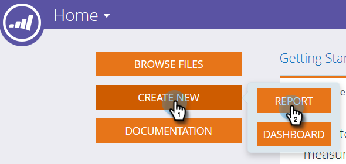
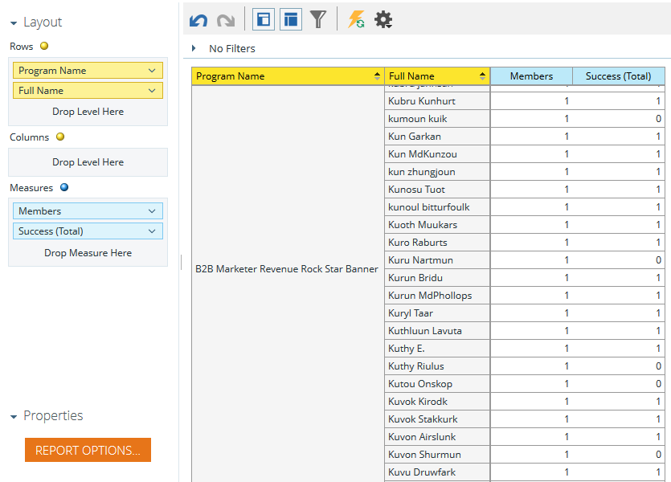

# リードを一覧表示するプログラムメンバーシップ分析レポートの作成 {#build-a-program-membership-analysis-report-that-lists-leads}

すべてのプログラムメンバー名を表示するプログラムメンバーシップ分析レポートを作成するには、次の手順に従います。

>[!AVAILABILITY]
>
>すべての Marketo Engage ユーザがこの機能を購入しているわけではありません。 詳しくは、アドビのアカウントチーム（担当のアカウントマネージャー）にお問い合わせください。

1. **[!UICONTROL 収益エクスプローラ]**&#x200B;を起動します。

   

1. 「**[!UICONTROL 新規作成]**」をクリックし、「**[!UICONTROL レポート]**」をクリックします。

   

1. 「**[!UICONTROL プログラムメンバーシップ分析]**」を選択して、「**[!UICONTROL OK]**」をクリックします。

   

1. **[!UICONTROL プログラム名]**&#x200B;の黄色の点を見つけて、ダブルクリックします。

   

1. **[!UICONTROL メンバー]**&#x200B;の青色の点を見つけて、ダブルクリックします。

   

1. **[!UICONTROL 成功（合計）]**&#x200B;の青色の点を見つけて、ダブルクリックします。

   

簡単ですね。

_[!UICONTROL 氏名]_&#x200B;のようなリード属性をすばやく追加して、メンバーが誰かを確認できます。

>[!TIP]
>
>選択できるリード／企業属性は多数あります。 確認してみてください。

1. **[!UICONTROL 氏名]**&#x200B;の黄色い点をみつけて、ダブルクリックします。

   

これで手順は完了です。

