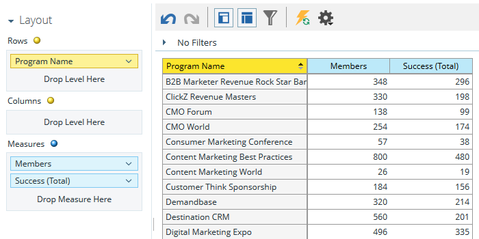

# リストがリード{#build-a-program-membership-analysis-report-that-lists-leads}を引くプログラムメンバーシップ分析レポートを作成します。

次の手順に従って、すべてのプログラムメンバー名を表示するプログラムメンバーシップ分析レポートを作成します。

>[!AVAILABILITY]
>
>この機能を購入していないお客様もいます。  詳細は、営業取引先責任者にお問い合わせください。

1. 売上高エクスプローラを起動します。

   

1. 「**新規作成**」をクリックし、「**レポート**」をクリックします。

   

1. 「**プログラムメンバーシップ分析**」を選択し、「**OK**」をクリックします。

   

1. プログラム名の黄色い点を探して、重複キーを押しながらクリックします。

   

1. Membersの青い点を検索し、重複を押しながらクリックします。

   

1. 成功（合計）青い点を探し、重複キーを押しながらクリックします。

   

簡単だった？

_フルネーム_&#x200B;などのリード属性を簡単に追加して、メンバーが誰かを調べることができます。

>[!TIP]
>
>選択できるリード/会社属性は豊富です。 見ろ！

1. **フルネーム**&#x200B;の黄色い点を探して重複クリックします。

   

あった！

