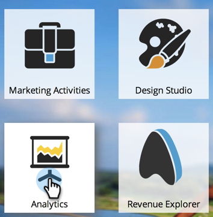
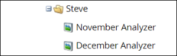

# プログラムアナライザーの複製 {#clone-a-program-analyzer}

アナライザーを保存した後、それを複製して新しいアナライザーを作成するのは簡単です。 次に、新しいアナライザーに変更が必要な場合は、アクセスして編集します。

1. 「**[!UICONTROL 分析]**」タイルをクリックします。

   

1. 「**[!UICONTROL プログラムアナライザー]**」タイルをクリックします。

   

1. 保存したアナライザーが開いている間に、アナライザーのアクションドロップダウンを開き、「**[!UICONTROL アナライザーを複製]**」を選択します。

   

1. 複製したアナライザーの場所を&#x200B;**[!UICONTROL 複製先]**&#x200B;ドロップダウンおよび&#x200B;**[!UICONTROL フォルダー]**&#x200B;ドロップダウンから選択します。

   

1. 複製したアナライザーに名前を付け、「**[!UICONTROL 複製]**」をクリックします。

   

1. 2 つの同じアナライザーの名前が異なるようになります。 クローンを開き、必要な変更をおこないいます。

   

   >[!MORELIKETHIS]
   >
   >[[!UICONTROL プログラムアナライザーの作成]](/help/marketo/product-docs/reporting/revenue-cycle-analytics/program-analytics/create-a-program-analyzer.md)
