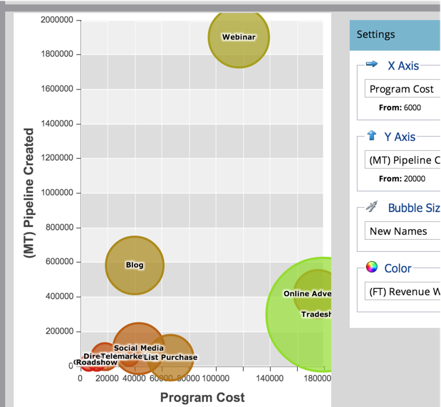

# プログラムアナライザーを使用したチャネルの効果の比較 {#compare-channel-effectiveness-with-the-program-analyzer}

プログラムアナライザーを使用して、チャネルコスト、メンバー獲得、パイプライン、売上高などを比較し、最も効果が高いチャネルと最も効果が低いチャネルを特定します。

>[!PREREQUISITES]
>
>[プログラムアナライザーの作成](/help/marketo/product-docs/reporting/revenue-cycle-analytics/program-analytics/create-a-program-analyzer.md)

1. **My Marketo** で「**分析**」をクリックします。

   

1. 「**プログラムアナライザー**」を選択します。

   

1. 「表示」を「**チャネル別**」に変更します。

   

1. 「**X 軸**」ドロップダウンを使用して、横軸の指標を選択します。まず、**プログラムコスト**&#x200B;から始めましょう。

   

1. 「Y 軸」ドロップダウンを使用して、縦軸の指標を選択します。ここでは、「**（FT）パイプラインの作成**」を行います。

   

   >[!NOTE]
   >
   >プログラムアナライザーで選択できる指標の多くは、ファーストタッチ（FT）計算とマルチタッチ（MT）計算で利用できます。[FT と MT のアトリビューションの違い](/help/marketo/product-docs/reporting/revenue-cycle-analytics/revenue-tools/attribution/understanding-attribution.md)を理解することが重要です。

1. 「**Y 軸**」ドロップダウンを使用して、「**（MT）パイプライン作成**」を選択します。

   

   このマルチタッチのアトリビューションを見ると、展示会やオンライン広告のチャネルより、ウェビナーのチャネルのほうが、作成されたパイプラインに対する影響が大きく、コストが低いことがわかります。

   次に、さらに 2 つのディメンションを追加します。

1. 「**バブルサイズ**」ドロップダウンを使用して、「**新しい名前**」などのように、追加の測定を選択します。

   

1. グラフの変化を確認してください。

   

   「**新しい名前**」で測定すると、ウェビナーチャネルが縮小するのがわかります。メンバーは多くても、新しいリードの創出という点では、展示会のチャネルより効果が小さいと結論付けることができるでしょう。

1. 最後に、「カラー」ドロップダウンを使用して、4 つ目のディメンションを追加します。「**（FT）獲得した売上高**」を選択します。

   

1. グラフのカラーの変化を確認します。

   

   色から、ファーストタッチアトリビューションで測定される、最も緑色のバブルである展示会チャネルが、売上高の獲得に最も大きく影響を与えていることがわかります。

1. ここで、カラー指標を「**（MT）獲得した売上高**」に変更すると、オンライン広告チャネルが最も緑色になり、ウェビナーや展示会チャネルよりも多く売上高に影響したことがわかります。

   

この例では、ファーストタッチで作成されたパイプラインで測定した場合、展示会のチャネルが、最もコストが高く（最も右寄り）、最も成功している（Y 軸上で最も上）ことがわかります。次に、作成された各チャネルのパイプラインをマルチタッチのアトリビューションによって測定する場合を考えましょう。

>[!TIP]
>
>以上の手順の例では、作成されたパイプラインに基づいて効果を測定します。「Y 軸」ドロップダウンを使用して、「新しい名前」、「メンバー」、「成功別コスト」など、チャネルの効果を測定する他の方法を選択します。

>[!MORELIKETHIS]
>
>* [プログラムアナライザーを使用したプログラムおよびチャネルの詳細の調査](/help/marketo/product-docs/reporting/revenue-cycle-analytics/program-analytics/explore-program-and-channel-details-with-the-program-analyzer.md)
>* [プログラムアナライザーを使用したプログラムの効果の比較](/help/marketo/product-docs/reporting/revenue-cycle-analytics/program-analytics/compare-program-effectiveness-with-the-program-analyzer.md)

