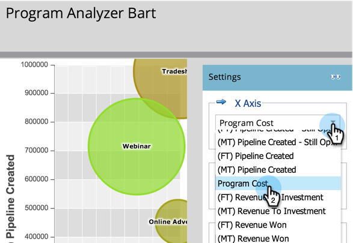

# チャネルの効果とプログラムアナライザとの比較 {#compare-channel-effectiveness-with-the-program-analyzer}

プログラムアナライザを使用して、チャネルコスト、会員獲得、パイプライン、売上高などを比較し、最も効果の高い、最も効果の低いチャネルを特定します。

>[!PREREQUISITES]
>
>* [プログラム分析計の作成](create-a-program-analyzer.md)

1. 「 **マイマーケティング** 」で「 **Analytics」をクリックします。**

   

1. **プログラムアナライザを選択します。**

   

1. 表示を「 **チャネル別******」に変更します。

   

1. 「 **X軸** 」ドロップダウンを使用して、水平軸の指標を選択します。 **プログラムコストと開始しましょう**。

   

1. Y軸ドロップダウンを使用して、縦軸の指標を選択します。 ここでは、 **(FT)パイプラインの作成について説明します**。

   

   >[!NOTE]
   >
   >プログラムアナライザーで選択できる指標の多くは、ファーストタッチ(FT)およびマルチタッチ(MT)の計算で使用できます。 FTとMTアトリビューションの [違いを理解することが重要です](/help/marketo/product-docs/reporting/revenue-cycle-analytics/revenue-tools/attribution/understanding-attribution.md)。

1. 「 **Y軸** 」(Y Axis **)ドロップダウンを使用して、「作成済み**(MT)パイプライン」(Pipeline Created)を選択します。

   

   このマルチタッチアトリビューション表示では、ウェビナーチャネルがパイプラインの作成に対してより多くの影響を与え、トレードショーやオンライン広告のチャネルよりも低いコストを生み出していることがわかります。

   次に、2つの次元を追加します。

1. 「 **バブルのサイズ** 」ドロップダウンを使用して、「 **新しい名前**」など、追加のメジャーを選択します。

   

1. グラフの変化を確認します。

   

   ウェビナーのチャネルは、 **新しい名前で測定したとおりに縮小しています**。 締めくくるのは、多くの会員がいるが、トレードショーチャネルよりも新しいリードを生み出すのに効果が低いということです。

1. 最後に、色ドロップダウンを使用して4つ目のディメンションを追加します。 [売上高 **の獲得]を選択します******。

   

1. グラフの色の変化に注目してください。

   

   色から学ぶと、最も緑のバブルであるトレードショーチャネルが、ファーストタッチアトリビューションで測定される最大の売上高に影響を与えていることがわかります。

1. 現在は、色指標を「 **(MT)売上高ウォン」に変更すると**、オンライン広告チャネルが最もグリーンになり、ウェビナーやトレードショーチャネルよりも多くの売上高に影響していることがわかります。

   

この例では、ファーストタッチで作成されたパイプラインを測定する際、トレードショーチャネルが最も高価（最も右側）で、最も成功している（Y軸の最も高い）ことがわかります。 次に、マルチタッチアトリビューションで測定された、各チャネルのパイプラインについて考えてみましょう。

>[!TIP]
>
>この手順の例では、作成されたパイプラインに基づいて有効性を測定します。 「Y軸」ドロップダウンを使用して、新しい名前、会員、成功あたりのコストなど、チャネルの有効性を測定する他の方法を選択します。

>[!NOTE]
>
>**関連記事**
>
>* [プログラムアナライザを使用したプログラムおよびチャネルの詳細の調査](explore-program-and-channel-details-with-the-program-analyzer.md)
>* [プログラムの効果とプログラムアナライザとの比較](compare-program-effectiveness-with-the-program-analyzer.md)

>

>[!NOTE]
>
>詳しくは、 [売上高サイクルエクスプローラーを参照してください](http://docs.marketo.com/display/docs/revenue+cycle+analytics)。
