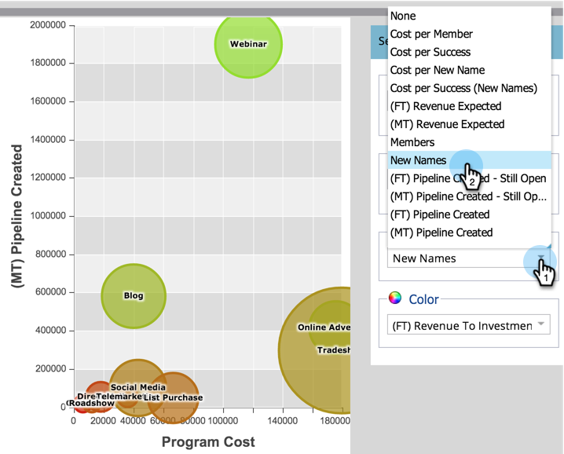

# [!UICONTROL &#x200B; プログラムアナライザー &#x200B;] を使用したチャネルの有効性の比較 {#compare-channel-effectiveness-with-the-program-analyzer}

[!UICONTROL &#x200B; プログラムアナライザー &#x200B;] を使用して、チャネルコスト、メンバーの獲得、パイプライン、収益などを比較し、最も効果的でないチャネルを特定します。

>[!PREREQUISITES]
>
>[ プログラムアナライザ [!UICONTROL &#x200B; の作成 &#x200B;]](/help/marketo/product-docs/reporting/revenue-cycle-analytics/program-analytics/create-a-program-analyzer.md)

1. **[!UICONTROL My Marketo]** で「**分析**」をクリックします。

   

1. 「プログラムアナライザー」を選択します。

   

1. 「表示」を「**[!UICONTROL チャネル別]**」に変更します。

   

1. 「**[!UICONTROL X 軸]**」ドロップダウンを使用して、横軸の指標を選択します。まず、**[!UICONTROL プログラムコスト]**&#x200B;から始めましょう。

   

1. **[!UICONTROL Y 軸]** ドロップダウンを使用して、垂直軸の指標を選択します。 ここでは、「**[!UICONTROL （FT）パイプラインの作成]**」を行います。

   

   >[!NOTE]
   >
   >プログラムアナライザーで選択できる指標の多くは、ファーストタッチ（FT）計算とマルチタッチ（MT）計算で利用できます。[FT と MT のアトリビューションの違い](/help/marketo/product-docs/reporting/revenue-cycle-analytics/revenue-tools/attribution/understanding-attribution.md)を理解することが重要です。

1. 「**[!UICONTROL Y 軸]**」ドロップダウンを使用して、「**[!UICONTROL （MT）パイプライン作成]**」を選択します。

   

   このマルチタッチのアトリビューションを見ると、展示会やオンライン広告のチャネルより、ウェビナーのチャネルのほうが、作成されたパイプラインに対する影響が大きく、コストが低いことがわかります。

   次に、さらに 2 つのディメンションを追加します。

1. 「**[!UICONTROL バブルサイズ]**」ドロップダウンを使用して、「**[!UICONTROL 新しい名前]**」などのように、追加の測定を選択します。

   

1. グラフの変化を確認してください。

   

   「**[!UICONTROL 新しい名前]**」で測定すると、ウェビナーチャネルが縮小するのがわかります。メンバーは多くても、新しいリードの創出という点では、展示会のチャネルより効果が小さいと結論付けることができるでしょう。

1. 最後に、「カラー」ドロップダウンを使用して、4 つ目のディメンションを追加します。「**[!UICONTROL （FT）獲得した売上高]**」を選択します。

   

1. グラフのカラーの変化を確認します。

   

   色から、ファーストタッチアトリビューションで測定される、最も緑色のバブルである展示会チャネルが、売上高の獲得に最も大きく影響を与えていることがわかります。

1. ここで、カラー指標を **[!UICONTROL （MT）売上高]** に変更すると、最も環境に優しいオンラインAdvertisingチャネルが、ウェビナーやトレードショーチャネルよりも多くの売上高 _時間の経過と共に_ に影響することがわかります。

   

この例では、ファーストタッチで作成されたパイプラインで測定した場合、展示会のチャネルが、最もコストが高く（最も右寄り）、最も成功している（Y 軸上で最も上）ことがわかります。次に、作成された各チャネルのパイプラインをマルチタッチのアトリビューションによって測定する場合を考えましょう。

>[!TIP]
>
>以上の手順の例では、作成されたパイプラインに基づいて効果を測定します。[!UICONTROL Y 軸 &#x200B;] ドロップダウンを使用して、[!UICONTROL &#x200B; 新規名 &#x200B;]、[!UICONTROL &#x200B; メンバー &#x200B;]、[!UICONTROL &#x200B; 成功あたりのコスト &#x200B;] など、チャネルの有効性を測定する他の方法を選択します。

>[!MORELIKETHIS]
>
>* [ プログラムアナライザーを使用したプログラムとチャネルの詳細の調査 ](/help/marketo/product-docs/reporting/revenue-cycle-analytics/program-analytics/explore-program-and-channel-details-with-the-program-analyzer.md)
>* [ プログラムの有効性と [!UICONTROL &#x200B; プログラム アナライザー &#x200B;]](/help/marketo/product-docs/reporting/revenue-cycle-analytics/program-analytics/compare-program-effectiveness-with-the-program-analyzer.md) の比較
