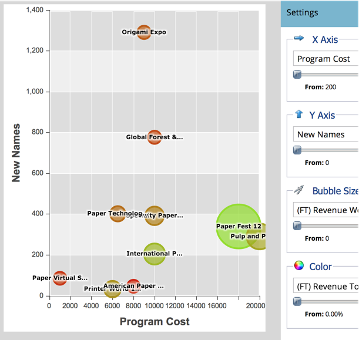

# プログラムアナライザーを使用したプログラムの効果の比較 {#compare-program-effectiveness-with-the-program-analyzer}

プログラムアナライザーを使用して、プログラムコスト、メンバー獲得、パイプライン、売上高を比較することで、最も効果の高いまたは最も効果の低いプログラムを特定します。

>[!PREREQUISITES]
>
>[プログラムアナライザーの作成](/help/marketo/product-docs/reporting/revenue-cycle-analytics/program-analytics/create-a-program-analyzer.md)

1. 「**分析**」をクリックします。

   

1. 「プログラムアナライザー」を選択します。

   

1. 「表示」を「プログラム別」に変更します。

   

1. チャネルフィルターを使用して、表示を 1 つまたは 2 つのチャネルに縮小します。ここでは、Tradeshow チャネルのプログラムについて見てみましょう。

   

   >[!TIP]
   >
   >プログラムを 1 つのチャネルに絞り込む簡単な方法は、**表示**／**チャネル別**&#x200B;を選択し、そのチャネルのバブルをクリックして、ポップアップダイアログでチャネル名をクリックすることです。

1. 「X 軸」ドロップダウンを使用して、横軸の指標を選択します。まず、「プログラムコスト」から始めます。

   

1. 「Y 軸」ドロップダウンを使用して、縦軸の指標を選択します。新しいリードをキャプチャするのに適したプログラムを見つけるには、「新しい名前」を選択します。

   

1. スライダーをオンにしてズームインします。

   

   >[!TIP]
   >
   >また、線形から対数スケールに変更したり、その逆に変更したりして、表示を向上させることもできます。上部の&#x200B;**拡大・縮小**&#x200B;メニューを使用します。

1. 結果のグラフを表示します。

   

   この例では、Origami Expo は、新しい名前を取得し、中コストで、そのチャネル内の他のすべてのプログラムよりもはるかに優れていることがわかります。ただし、それだけではありません。さらに 2 つの指標を追加して、より深く理解できるようにします。

1. 「バブルサイズ」ドロップダウンを使用して、バブルサイズで比較する指標を選択します。例として、「（FT）獲得した売上高」を選択します。

   

   >[!NOTE]
   >
   >プログラムアナライザーで選択できる指標の多くは、ファーストタッチ（FT）計算とマルチタッチ（MT）計算で利用できます。[FT と MT のアトリビューションの違い](/help/marketo/product-docs/reporting/revenue-cycle-analytics/revenue-tools/attribution/understanding-attribution.md)を理解することが重要です。

1. グラフ内でバブルのサイズが変化することを確認します。

   

   「**（FT）獲得した収益**」を加えると、Origami Expo が多くの新しい名前を獲得したのに対し、比較的少ない売上高に終わったことがすぐにわかります。また、Paper Fest 12 プログラムは、獲得した名前は少ないですが、より多くの売上高の獲得に影響を与えた（より大きなバブル）ため、優れた名前を獲得したことが確認できます。

1. 「カラー」ドロップダウンを使用して、4 つ目の指標を追加します。「（FT）売上高対投資」を見てみましょう。

   

1. グラフのカラーの変化を確認します。

   

Paper Fest 12 プログラムは、より多くの売上高（より大きなバブル）に影響を与えるだけでなく、比較的高いプログラムコスト（右端）にもかかわらず、Tradeshow チャネルの全プログラムの中で最も高い投資収益率（最も緑色のバブル）を持ちます。

>[!TIP]
>
>1 つのチャネルの複数のプログラムを、他のチャネルのプログラムと簡単に比較できます。ウィンドウ上部の「**チャネルフィルター**」を使用して、チャネルを追加するだけです。

>[!MORELIKETHIS]
>
>* [プログラムアナライザーを使用したプログラムおよびチャネルの詳細の調査](/help/marketo/product-docs/reporting/revenue-cycle-analytics/program-analytics/explore-program-and-channel-details-with-the-program-analyzer.md)
>* [プログラムアナライザーを使用したチャネルの効果の比較](/help/marketo/product-docs/reporting/revenue-cycle-analytics/program-analytics/compare-channel-effectiveness-with-the-program-analyzer.md)

