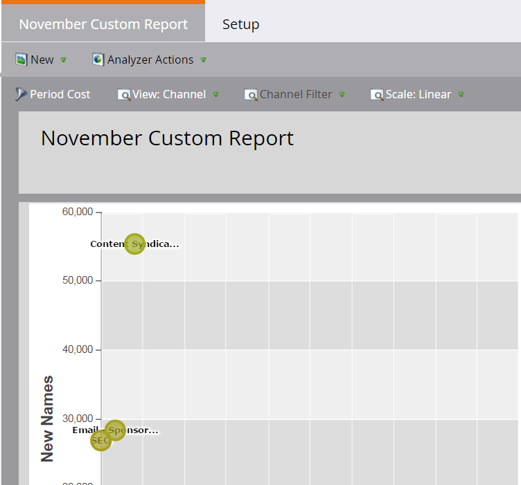

# [!UICONTROL &#x200B; プログラムアナライザ &#x200B;] の作成 {#create-a-program-analyzer}

マーケティング売上高に最も貢献しているプログラムやチャネルを見つけましょう。プログラムアナライザーを使用して、すべてのコストとリターンの詳細を、プログラム別やチャネル別に調べ、比較します。

>[!NOTE]
>
>プログラムアナライザーから適切なデータを取得するには、CRM の連絡先に商談の役割があり、Marketo プログラムが完全に設定され、[期間コスト](/help/marketo/product-docs/reporting/revenue-cycle-analytics/revenue-tools/define-period-costs.md)、プログラムステータス、成功が定義されていることを確認します。

>[!TIP]
>
>コストのかからないプログラムをプログラムアナライザーに表示させるには、[期間コスト](/help/marketo/product-docs/reporting/revenue-cycle-analytics/revenue-tools/define-period-costs.md)を $0 に設定します。

1. 「**[!UICONTROL 分析]**」タイルをクリックします。

   

1. 「**[!UICONTROL プログラムアナライザー]**」タイルをクリックします。

   

1. 標準のプログラムアナライザーが表示されます。必要な変更を加えます。

   

1. 「**[!UICONTROL 設定]**」タブをクリックして、フィルターを追加およびカスタマイズします。

   

1. 例えば、「期間コスト [!UICONTROL &#x200B; フィルターをカスタマイズするには &#x200B;] フィルターをダブルクリックします。

   

1. 分析する期間を選択し、「**[!UICONTROL 適用]**」をクリックします。

   

   >[!TIP]
   >
   >特定の範囲を選択するには、「**[!UICONTROL カスタム]**」を選択し、「**[!UICONTROL 開始]**」および「**[!UICONTROL 終了]**」フィールドを使用します。

1. 新しいカスタムアナライザーを保存する場合は、「**[!UICONTROL アナライザーのアクション]**」ドロップダウンで「**[!UICONTROL 名前を付けて保存]**」を選択します。

   

1. [!UICONTROL &#x200B; 保存先 &#x200B;] および [!UICONTROL &#x200B; フォルダー &#x200B;] ドロップダウンを使用して、カスタムアナライザーを保存する場所を選択します。 新しいカスタムアナライザーに名前を付けます。説明はオプションです。「**[!UICONTROL 保存]**」をクリックします。

   

1. これで完了です。メインのタブをクリックすると、プログラムとチャネルの調査と比較が始まります。

>[!NOTE]
>
>プログラムアナライザーで選択できる指標の多くは、ファーストタッチ（FT）計算とマルチタッチ（MT）計算で利用できます。[FT と MT のアトリビューションの違い](/help/marketo/product-docs/reporting/revenue-cycle-analytics/revenue-tools/attribution/understanding-attribution.md)を理解することが重要です。

>[!MORELIKETHIS]
>
>* [ チャネルの有効性と [!UICONTROL &#x200B; プログラムアナライザーの比較 &#x200B;]](/help/marketo/product-docs/reporting/revenue-cycle-analytics/program-analytics/compare-channel-effectiveness-with-the-program-analyzer.md)
>* [ プログラムの有効性と [!UICONTROL &#x200B; プログラム アナライザー &#x200B;]](/help/marketo/product-docs/reporting/revenue-cycle-analytics/program-analytics/compare-program-effectiveness-with-the-program-analyzer.md) の比較
>* [ プログラムアナライザーを使用したプログラムとチャネルの詳細の調査 ](/help/marketo/product-docs/reporting/revenue-cycle-analytics/program-analytics/explore-program-and-channel-details-with-the-program-analyzer.md)
>* [ プログラムアナライザ [!UICONTROL &#x200B; のクローン &#x200B;]](/help/marketo/product-docs/reporting/revenue-cycle-analytics/program-analytics/clone-a-program-analyzer.md)
