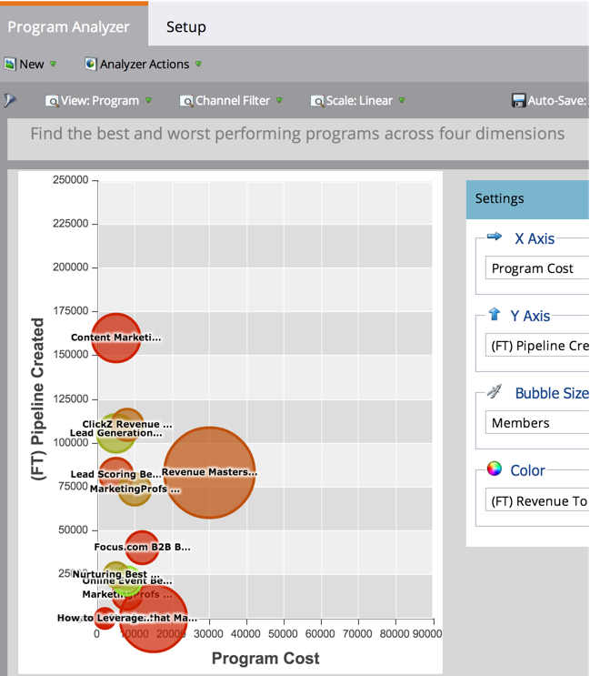

# プログラムアナライザを使用したプログラムおよびチャネルの詳細の調査 {#explore-program-channel-details-with-the-program-analyzer}

詳細なプログラムとチャネルの統計は、プログラムアナライザーで確認できます。 また、売上高サイクルエクスプローラで開くこともできます。

>[!NOTE]
>
>**前提条件**
>
>* [プログラム分析計の作成](create-a-program-analyzer.md)

>[!NOTE]
>
>**可用性**
>
>この機能は、Marketoのすべてのエディションに適用されるわけではありません。 詳しくは、アカウントマネージャーにお問い合わせください。

1. 「 **Analytics**」をクリックします。

   

1. プログラムアナライザを選択します。

   

1. (選択した **表示に応じて** )チャネルまたはプログラムに関する特定の統計を表示するには、対応するバブルをクリックします。

   

   >[!NOTE]
   >
   >プログラムアナライザーで選択できる指標の多くは、ファーストタッチ(FT)およびマルチタッチ(MT)の計算で使用できます。 FTとMTアトリビューションの [違いを理解することが重要です](/help/marketo/product-docs/reporting/revenue-cycle-analytics/revenue-tools/attribution/understanding-attribution.md)。

1. 1つのチャネル内のすべてのプログラムを比較するには、ポップアップダイアログでチャネル名をクリックします。

   

1. これで、その1つのチャネル内の個々のプログラムを比較できます。

   

   >[!NOTE]
   >
   >1つのチャネルをクリックすると、表示が「プログラム別」に切り替わり、そのチャネルのみにフィルタされます。 すべてのチャネルに戻るには、 **表示** / **チャネル別を選択します**。

1. 売上高サイクルエクスプローラを開いて統計をさらに詳しく調べるには、ポップアップダイアログでその数をクリックします。

   

   >[!NOTE]
   >
   >詳しくは、 [売上高エクスプローラーの高度な分析を参照してください](http://docs.marketo.com/display/docs/revenue+explorer)。
