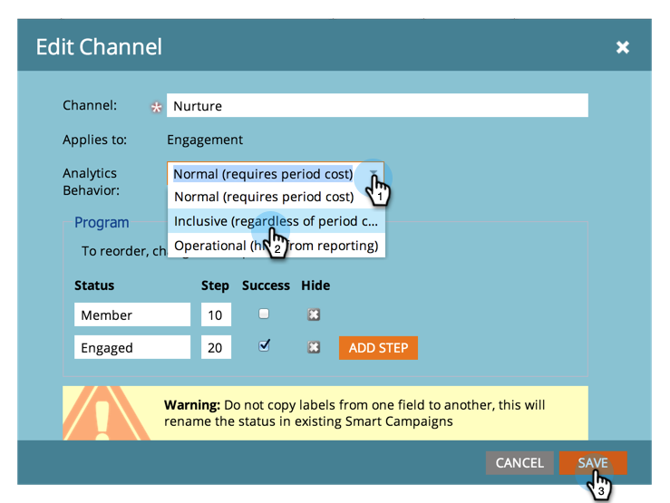

# 期間原価がないプログラムを収益エクスプローラーとアナライザーで使用可能にする {#make-a-program-without-a-period-cost-available-in-revenue-explorer-and-analyzers}

プログラム期間原価を使用すると、プログラムの「金額」と「タイミング」を定義できます。これは、収益サイクルエクスプローラーと[アナライザー](/help/marketo/product-docs/reporting/revenue-cycle-analytics/opportunity-influence-analyzer/tell-the-marketing-story-with-an-opportunity-influence-analyzer.md)に表示されます。

>[!NOTE]
>
>**管理者権限が必要**

期間原価がない場合でも、一部のプログラムを含める必要がある場合があります。期間原価には 0 を入力できますが、これらのプログラムを簡単に組み込むことができるようになりました。

>[!NOTE]
>
>プログラムアナライザーは、期間原価別にプログラムの成功をバケット化します。期間原価がない場合、プログラムの分析動作に関係なく、プログラムの成功は表示されません。分析動作が設定されている場合、商談指標（パイプラインの商談、獲得した収益など）のデータが表示されます。

1. 管理者セクションで、「**タグ**」をクリックします。

   

1. チャネルを展開し、目的のチャネルをダブルクリックします。

   >[!NOTE]
   >
   >このチャネルを使用するプログラムは、期間原価に関係なく、収益エクスプローラーとアナライザーで使用できます。この変更は翌日に有効になります。

   

1. 分析の動作を包括的に変更し、「**保存**」をクリックします。

   

>[!TIP]
>
>「オペレーショナル」オプションに気づきましたか？これは逆です。期間原価に関係なく、これらのプログラムは除外されます。

これで完了です。変更されたチャネルを使用するプログラムは、期間原価を必要とせずに、収益エクスプローラーおよびアナライザーに含まれます。

>[!MORELIKETHIS]
>
>[プログラムレベルでの分析動作の上書き](/help/marketo/product-docs/reporting/revenue-cycle-analytics/program-analytics/override-analytics-behavior-at-the-program-level.md)
