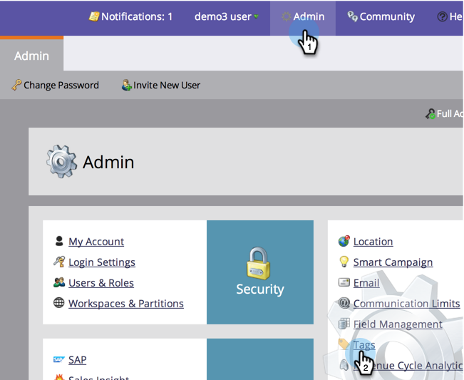
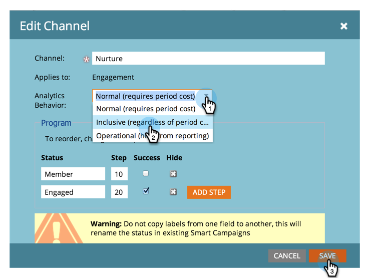

# 期間原価がないプログラムを収益エクスプローラーとアナライザーで使用可能にする {#make-a-program-without-a-period-cost-available-in-revenue-explorer-and-analyzers}

プログラム期間原価を使用すると、プログラムの「金額」と「タイミング」を定義できます。 これは、収益サイクルエクスプローラーと[アナライザー](/help/marketo/product-docs/reporting/revenue-cycle-analytics/opportunity-influence-analyzer/tell-the-marketing-story-with-an-opportunity-influence-analyzer.md)に表示されます。

>[!NOTE]
>
>**管理者権限が必要**

期間コストがない場合でも、一部のプログラムを含める必要がある場合があります。 期間コストには 0 を入力できますが、これらのプログラムをより簡単に含めることができるようになりました。

>[!NOTE]
>
>プログラムアナライザーは、期間コスト別にプログラムの成功を区分します。 期間コストがない場合、プログラムの分析動作に関係なく、プログラムの成功は表示されません。 分析動作が設定されている場合、商談指標（パイプラインの商談、獲得した収益など）のデータが表示されます。

1. 「[!UICONTROL 管理]」セクションで「**[!UICONTROL タグ]**」をクリックします。

   

1. チャネルを展開し、目的のチャネルをダブルクリックします。

   >[!NOTE]
   >
   >このチャネルを使用するすべてのプログラムは、期間コストの有無に関係なく、収益エクスプローラーとアナライザーで利用できるようになります。 この変更は翌日に有効になります。

   

1. [!UICONTROL 分析の動作]を&#x200B;**包括的**&#x200B;に変更し、「**[!UICONTROL 保存]**」をクリックします。

   

>[!TIP]
>
>「オペレーショナル」オプションに気づきましたか？ これは逆です。 期間コストに関係なく、これらのプログラムは除外されます。

これで完了です。 変更されたチャネルを使用するプログラムは、期間コストなしで収益エクスプローラーおよびアナライザーに含まれるようになります。

>[!MORELIKETHIS]
>
>[プログラムレベルでの分析動作の上書き](/help/marketo/product-docs/reporting/revenue-cycle-analytics/program-analytics/override-analytics-behavior-at-the-program-level.md)
