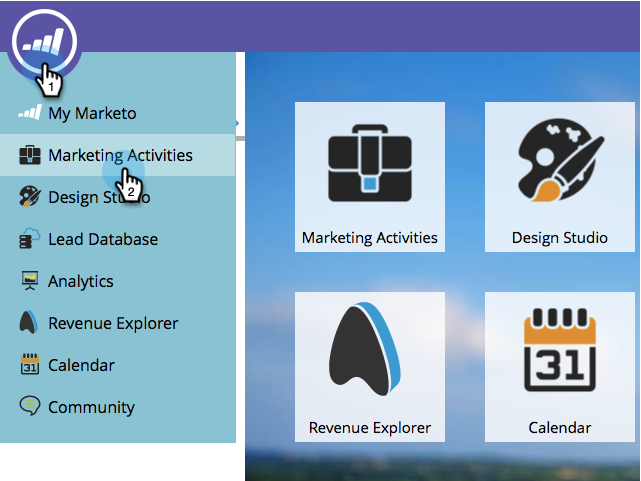
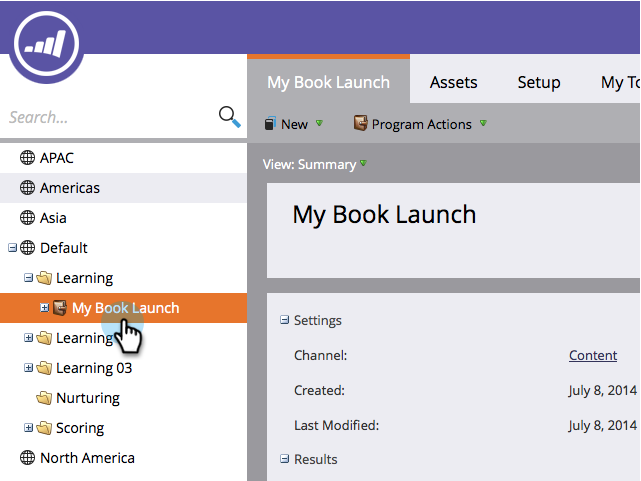
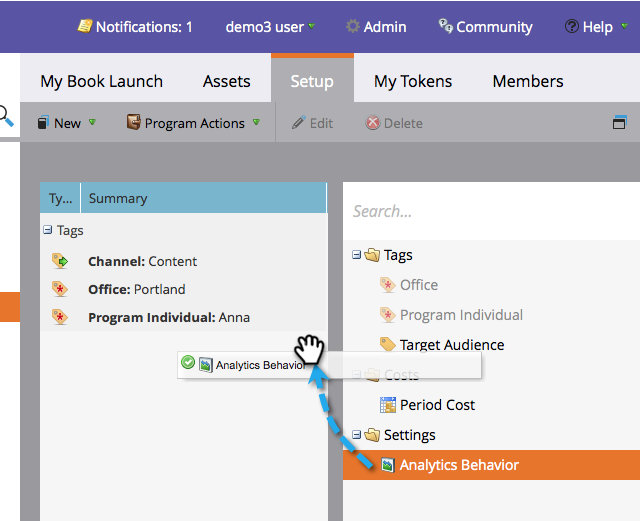

# プログラムレベルでの分析の動作を上書き {#override-analytics-behavior-at-the-program-level}

[チャネルの管理者レベルでの分析動作](/help/marketo/product-docs/reporting/revenue-cycle-analytics/program-analytics/make-a-program-without-a-period-cost-available-in-revenue-explorer-and-analyzers.md)を設定することができますが、プログラムレベルで上書きすることもできます。 その方法をご紹介します。

1. **[!UICONTROL マーケティングアクティビティ]**&#x200B;領域に移動します。

   

1. プログラムを選択します。

   

1. 「**[!UICONTROL 設定]**」タブで、「[!UICONTROL 分析動作]」をキャンバスにドラッグします。

   

1. 必要な[!UICONTROL 分析動作]を選択します。

   >[!NOTE]
   >
   >**定義**
   >
   >* **包含** - このオプションを使用すると、期間原価が含まれているかどうかに関係なく、収益エクスプローラーおよびアナライザーでプログラムをレポートに表示できます。
   >* **オペレーショナル** - このオプションを選択すると、プログラムが収益エクスプローラーまたはアナライザーに表示されなくなります。

   >[!NOTE]
   >
   >デフォルトの動作（この設定が適用されていない場合）は **1 つ以上の期間原価（0 ドルが割り当てられている期間も含む）がある**&#x200B;場合にのみ分析に含まれます。

   

1. 「**[!UICONTROL 保存]**」をクリックします。

   

これで完了です。 これで、プログラムレベルで分析の動作を上書きする方法がわかりました。

>[!NOTE]
>
>変更は翌日に反映され、収益エクスプローラーおよびアナライザーを使用可能にするか、取り出されます。
