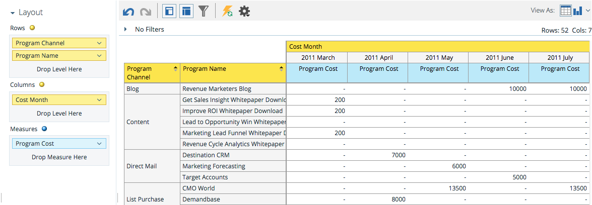

# プログラムコスト分析領域について{#understanding-the-program-cost-analysis-area}

[プログラムコストの分析]領域では、個々のプログラムの有効性を分析したり、チャネル別の要約結果を一定期間表示したりできます。

## ビジネスの質問の例{#example-business-questions}

各チャネルが1か月に生成した新しい名前の数はいくつか。

新しい名前あたりのコストは、1か月あたりのチャネル別でどのくらいか。

プログラムで成功したのは、生成された新しい名前の何パーセントか。

1か月あたりのプログラムあたりの支出額は？

## プログラムコスト分析のDimensionと測定{#program-cost-analysis-dimensions-and-measures}

>[!NOTE]
>
>黄色の点は寸法、青の点は測定値です。

## 投資{#investment}

| 測定 | 説明 |
|---|---|
| メンバーあたりのコスト | プログラムのメンバーあたりの平均コスト |
| 新しい名前当たりのコスト | プログラムが取得したリードあたりの平均コスト |
| 成功あたりのコスト | プログラムの進行で成功したリードあたりの平均コスト |
| 成功あたりのコスト（新しい名前） | プログラムが獲得し、プログラムの進行で成功を収めたリードあたりの平均コスト。 |
| プログラムコスト | プログラムの総期間原価 |

## メンバーシップ{#membership}

<table> 
 <tbody> 
  <tr> 
   <th>測定</th> 
   <th>説明</th> 
  </tr> 
  <tr> 
   <td>
%新しい名前
</td> 
   <td>プログラムが獲得したリードの割合</td> 
  </tr> 
  <tr> 
   <td>メンバー</td> 
   <td>プログラムのリードの合計</td> 
  </tr> 
  <tr> 
   <td>新しい名前</td> 
   <td>プログラムが取得した新しい名前の合計</td> 
  </tr> 
 </tbody> 
</table>

## プログラム属性{#program-attributes}

| Dimension | 説明 |
|---|---|
| プログラムチャネル | プログラムチャネル |
| プログラム名 | プログラム名 |

## プログラムコストの時間枠{#program-cost-timeframe}

| Dimension | 説明 |
|---|---|
| 年 | プログラムコスト期間 |
| 四半期 | プログラムコスト期間 |
| 月 | プログラムコスト期間 |

## プログラムタグ{#program-tags}

| 測定 | 説明 |
|---|---|
| 業界 | プログラムタグ |
| 製品ライン | プログラムタグ |
| プログラム所有者 | プログラムタグ |
| 地域 | プログラムタグ |

## 成功{#success}

| 測定 | 説明 |
|---|---|
| 成功率（新しい名前） | プログラムが獲得し、プログラムの進行で成功を収めたリードの割合 |
| 成功率（合計） | プログラムの進行で成功を収めたリードの割合 |
| 成功（新しい名前） | プログラムの進行で成功した新しい名前の合計数です |
| 成功（合計） | プログラムの進行で成功を収めたリードの合計数 |

