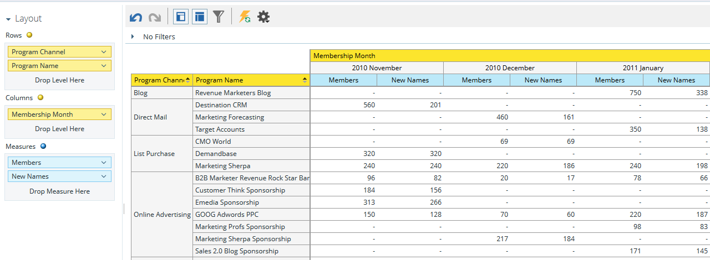

# プログラムメンバーシップ分析領域について {#understanding-the-program-membership-analysis-area}

プログラムメンバーシップ分析領域を使用すると、個々のプログラムの効果を分析したり、一定期間、チャネル別に要約された結果を表示したりできます。

## ビジネスの質問の例 {#example-business-questions}

特定の月の中で、プログラムに参加した人のチャネル別の人数は？

特定のプログラムの達成条件に達した人数は？

各プログラム／チャネルが 1 か月間に創出した新しい名前の数は？

## プログラムメンバーシップ分析のディメンションと測定 {#program-membership-analysis-dimensions-and-measures}

>[!NOTE]
>
>黄色のドットはディメンション、青のドットは測定です。

### メンバーシップ {#membership}

| 測定 | 説明 |
|---|---|
| 新しい名前の割合 | プログラムで取得されたリードの割合 |
| メンバー | プログラムのリードの合計 |
| 新しい名前 | プログラムが獲得した新しい名前の合計 |

### プログラムの属性 {#program-attributes}

| ディメンション | 説明 |
|---|---|
| プログラムチャネル | プログラムチャネル |
| プログラム名 | プログラム名 |

### プログラムメンバーシップの期間 {#program-membership-timeframe}

| ディメンション | 説明 |
|---|---|
| 年 | プログラムメンバーシップの期間 |
| 四半期 | プログラムメンバーシップの期間 |
| 月 | プログラムメンバーシップの期間 |
| 週 | プログラムメンバーシップの期間 |
| 日付 | プログラムメンバーシップの期間 |

### 成功 {#success}

| 測定 | 説明 |
|---|---|
| 成功率（新規リード） | プログラムによって獲得され、その後プログラムの進行で成功に到達したリードの割合 |
| 成功の割合（合計） | プログラムの進行で成功に到達したリードの割合 |
| 成功（新しい名前） | プログラムの進行で成功に到達した新規リードの合計数 |
| 成功（合計） | プログラムの進行で成功に到達したリードの合計数 |
