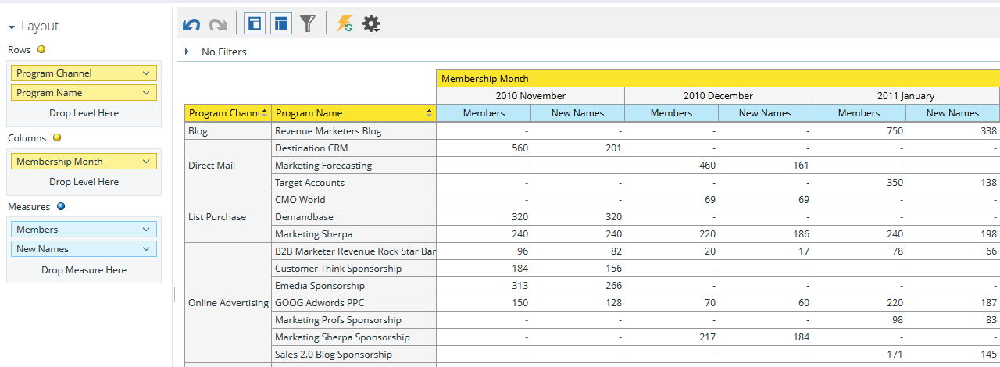

# プログラムメンバーシップ分析領域について{#understanding-the-program-membership-analysis-area}

[プログラムメンバーシップの分析]領域では、個々のプログラムの効果を分析したり、チャネル別の要約結果を一定期間表示したりできます。

## ビジネスの質問の例{#example-business-questions}

ある1か月のチャネル別プログラムに参加した人数は？

特定のプログラムの成功基準に達した人の数は？

各プログラム/チャネルが1か月に生成した新しい名前の数はいくつか。

## プログラムメンバーシップ分析のDimensionと測定{#program-membership-analysis-dimensions-and-measures}

>[!NOTE]
>
>黄色の点は寸法、青の点は測定値です。

### メンバシップ {#membership}

| 測定 | 詳細 |
|---|---|
| 新しい名前の数：% | プログラムで獲得したリードの割合 |
| メンバ | プログラムのリードの合計 |
| 新しい名前 | プログラムが取得した新しい名前の合計 |

### プログラム属性{#program-attributes}

| 寸法 | 詳細 |
|---|---|
| プログラムチャネル | プログラムチャネル |
| プログラム名 | プログラム名 |

### プログラムメンバーシップ期間{#program-membership-timeframe}

| 寸法 | 詳細 |
|---|---|
| 年 | プログラムのメンバーシップ期間 |
| 四半期 | プログラムのメンバーシップ期間 |
| 月 | プログラムのメンバーシップ期間 |
| 週 | プログラムのメンバーシップ期間 |
| 日 | プログラムのメンバーシップ期間 |

### 成功 {#success}

| 測定 | 詳細 |
|---|---|
| 成功の数（新しい名前） | プログラムが獲得し、プログラムの進行で成功を収めたリードの割合 |
| 成功の数（合計） | プログラムの進行で成功を収めたリードの割合 |
| 成功（新しい名前） | プログラムの進行で成功した新しい名前の合計数です |
| 成功（合計） | プログラムの進行で成功を収めたリードの合計数 |
