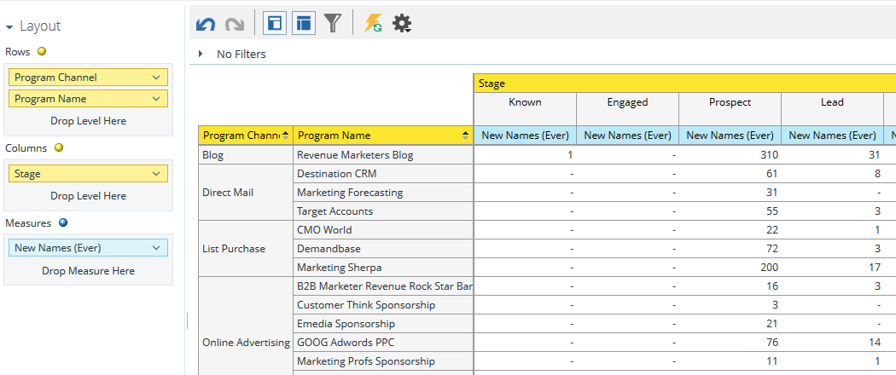
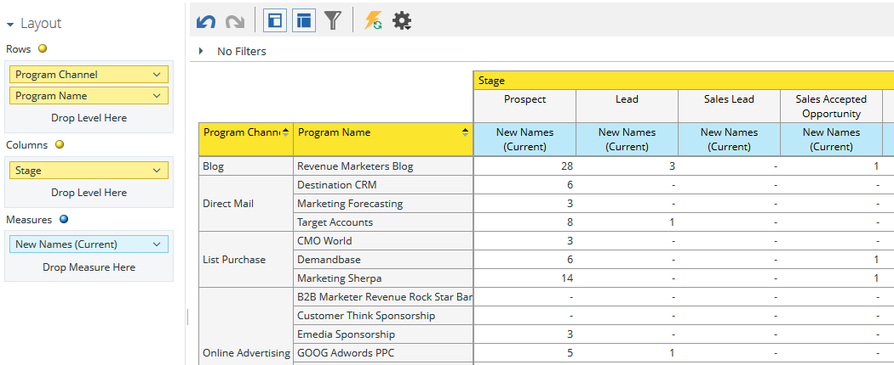
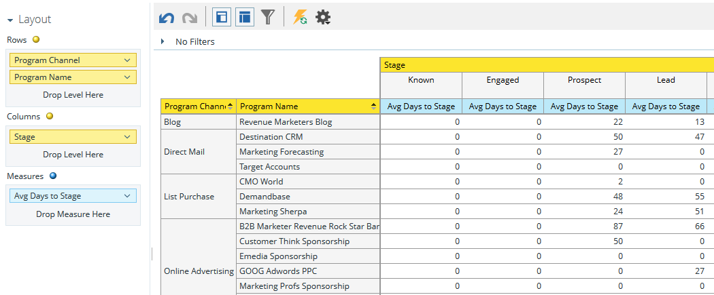

# プログラム収益ステージ分析領域について {#understanding-the-program-revenue-stage-analysis-area}

この分析領域では、個々のプログラムの効果を分析することも、特定の期間のチャネルごとに要約した結果を確認することもできます。 生成された新しい名前のうち、収益サイクルモデルの成功パス内で特定のステージに到達したものがどれだけあるかについてのインサイトを提供します。

**この分析領域を使用して回答できるビジネスの質問の例を次に示します**。

特定のプログラムで、モデルの特定のステージに達した新しい名前はいくつあるか。

特定のプログラムで、モデルの特定のステージにある新しい名前は現在いくつあるか。

リードが現在のステージに達するまでに何日かかっているか。

**プログラム収益ステージ分析のディメンションと測定**

ディメンションと測定値は機能別に分類され、システムでは黄色と青色のドットで表されます。黄色のドットがディメンション、青色のドットが測定値です。 プログラム収益ステージ分析の各ディメンションと測定を使用して、レポートで特定の質問に答えます。

カテゴリ内で使用可能なディメンションまたは測定を表示するには、カテゴリ名の横にある右矢印をクリックして、カテゴリリストを展開します。 下矢印をクリックして、カテゴリリストを折りたたみます。

>[!TIP]
>
>レポート内で特定のディメンションまたは指標に関する詳細情報を表示するには、その項目にポインタを合わせます。

**モデルの属性**

<table>
 <tbody>
  <tr>
   <td colspan="1" rowspan="1"><strong>ディメンション</strong></td>
   <td colspan="1" rowspan="1">
<strong>説明</strong>
</td>
  </tr>
  <tr>
   <td colspan="1" rowspan="1">
モデルはアクティブか
</td>
   <td colspan="1" rowspan="1">
現在モデルが承認済みでアクティブかどうかを示します。
</td>
  </tr>
  <tr>
   <td colspan="1" rowspan="1">
ステージはアクティブか
</td>
   <td colspan="1" rowspan="1">
ステージがアクティブかどうかを示します。
</td>
  </tr>
  <tr>
   <td colspan="1" rowspan="1">
成功パス上
</td>
   <td colspan="1" rowspan="1">
ステージが成功パス上にあるかどうかを説明します
</td>
  </tr>
  <tr>
   <td colspan="1" rowspan="1">
モデル
</td>
   <td colspan="1" rowspan="1">
モデル名
</td>
  </tr>
  <tr>
   <td colspan="1" rowspan="1">
ステージ
</td>
   <td colspan="1" rowspan="1">
収益サイクルモデルに存在するステージ。 2 つのステージ間の測定を分析する際に、「開始」ステージとして使用されます
</td>
  </tr>
  <tr>
   <td colspan="1" rowspan="1">
ステージタイプ
</td>
   <td colspan="1" rowspan="1">
各ステージが在庫、SLA、またはゲートのどのタイプに分類されるかを説明します。
</td>
  </tr>
 </tbody>
</table>

**プログラムの属性**

<table>
 <tbody>
  <tr>
   <td colspan="1" rowspan="1">
<strong>ディメンション</strong>
</td>
   <td colspan="1" rowspan="1">
<strong>説明</strong>
</td>
  </tr>
  <tr>
   <td colspan="1" rowspan="1">
プログラムチャネル
</td>
   <td colspan="1" rowspan="1">
プログラムチャネル
</td>
  </tr>
  <tr>
   <td colspan="1" rowspan="1">
プログラム名
</td>
   <td colspan="1" rowspan="1">
プログラム名
</td>
  </tr>
 </tbody>
</table>

**プログラムコスト期間**

<table>
 <tbody>
  <tr>
   <td colspan="1" rowspan="1">
<strong>ディメンション</strong>
</td>
   <td colspan="1" rowspan="1">
<strong>説明</strong>
</td>
  </tr>
  <tr>
   <td colspan="1" rowspan="1">
コスト年
</td>
   <td colspan="1" rowspan="1">
プログラムコスト期間
</td>
  </tr>
  <tr>
   <td colspan="1" rowspan="1">
コスト四半期
</td>
   <td colspan="1" rowspan="1">
プログラムコスト期間
</td>
  </tr>
  <tr>
   <td colspan="1" rowspan="1">
コスト月
</td>
   <td colspan="1" rowspan="1">
プログラムコスト期間
</td>
  </tr>
 </tbody>
</table>

**ステージメンバーシップ**

<table>
 <tbody>
  <tr>
   <td colspan="1" rowspan="1">
<strong>測定</strong>
</td>
   <td colspan="1" rowspan="1">
<strong>説明</strong>
</td>
  </tr>
  <tr>
   <td colspan="1" rowspan="1">
モデルはアクティブか
</td>
   <td colspan="1" rowspan="1">
現在モデルが承認済みでアクティブかどうかを示します。
</td>
  </tr>
  <tr>
   <td colspan="1" rowspan="1">
ステージはアクティブか
</td>
   <td colspan="1" rowspan="1">
ステージがアクティブかどうかを示します。
</td>
  </tr>
  <tr>
   <td colspan="1" rowspan="1">
成功パス上
</td>
   <td colspan="1" rowspan="1">
ステージが成功パス上にあるかどうかを説明します
</td>
  </tr>
  <tr>
   <td colspan="1" rowspan="1">
新しい名前あたりのコスト
</td>
   <td colspan="1" rowspan="1">
ステージに到達した新しい名前の平均コスト
</td>
  </tr>
  <tr>
   <td colspan="1" rowspan="1">
新しい名前（現在）
</td>
   <td colspan="1" rowspan="1">
現在ステージに存在し、プログラムによって取得されたリードの合計数を示します。
</td>
  </tr>
  <tr>
   <td colspan="1" rowspan="1">
新しい名前（かつて）
</td>
   <td colspan="1" rowspan="1">
各ステージが在庫、SLA、またはゲートのどのタイプに分類されるかを説明します。
</td>
  </tr>
 </tbody>
</table>
