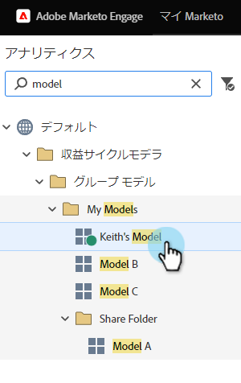
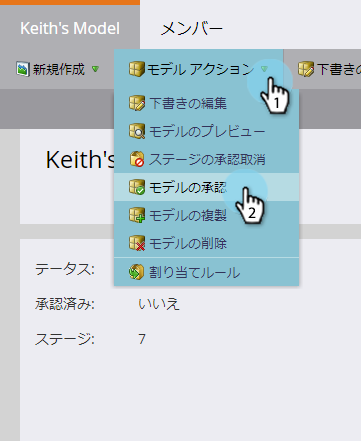
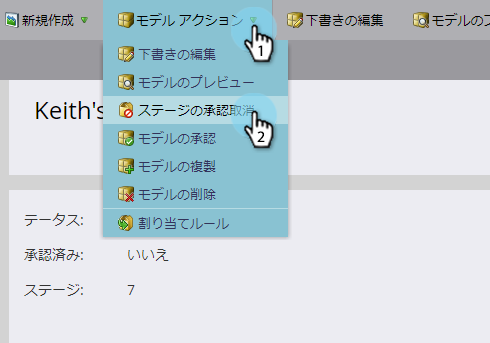

# 売上高モデルの承認/未承認{#approve-unapprove-a-revenue-model}

承認済みのモデルは、一度に1つだけ持つことができます。

>[!CAUTION]
>
>[モデル全体を承認する前に、個々のステージを](approving-stages-and-assigning-leads-to-a-revenue-model.md) 承認し、ユーザーを追加する必要があります。

## {#approve}を承認

1. 「**Analytics**」領域に移動します。

   

1. ツリーからモデルを選択します。

   

1. **モデルアクション**&#x200B;メニューから、**モデルを承認**&#x200B;を選択します。

   

1. 選択を確認するダイアログが表示されます。 「**承認**」をクリックします。

   

モデルが稼働した！

## {#unapprove}の未承認

>[!CAUTION]
>
>モデルを未承認にすると、すべてのユーザーがモデルから削除され、モデル内の履歴が削除されます。

1. 「**Analytics**」領域に移動します。

   

1. ツリーからモデルを選択します。

   

1. **モデルアクション**&#x200B;メニューをクリックし、**モデルを未承認**&#x200B;を選択します。

   

1. 表示されるダイアログで、**モデルを未承認**&#x200B;をクリックします。

   

おめでとう！ モデルが未承認になりました。

>[!CAUTION]
>
>モデルを承認解除すると、モデルからすべてのユーザーが削除され、モデル内の履歴がデータベースから削除されます。

