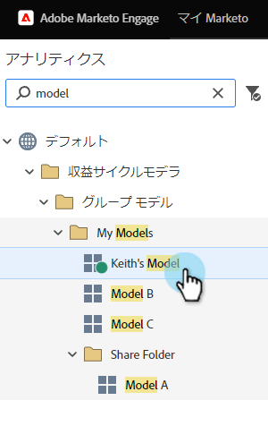
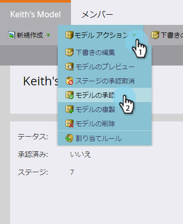
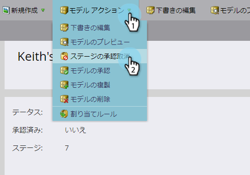

# 収益モデルの承認／承認取消 {#approve-unapprove-a-revenue-model}

一度に 1 つのモデルのみを承認済みにできます。

>[!CAUTION]
>
>モデル全体を承認する前に、[個々のステージ](/help/marketo/product-docs/reporting/revenue-cycle-analytics/revenue-cycle-models/approving-stages-and-assigning-leads-to-a-revenue-model.md)および追加されたリードを承認する必要があります。

## 承認 {#approve}

1. **[!UICONTROL 分析]**&#x200B;エリアに移動します。

   

1. ツリーからモデルを選択します。

   

1. **[!UICONTROL モデルアクション]**&#x200B;メニューから、「**[!UICONTROL モデルを承認]**」を選択します。

   

1. 選択を確認するダイアログが表示されます。「**[!UICONTROL 承認]**」をクリックします。

   

これで、モデルが作成されます。

## 承認取消 {#unapprove}

>[!CAUTION]
>
>モデルの承認を取り消すと、すべてのリードがモデルから削除され、モデル内の履歴が削除されます。

1. **[!UICONTROL 分析]**&#x200B;エリアに移動します。

   

1. ツリーからモデルを選択します。

   

1. **[!UICONTROL モデルアクション]**&#x200B;メニューをクリックして、「**[!UICONTROL モデルの承認を取消]**」を選択します。

   

1. 表示される[!UICONTROL モデルの承認を取消]ダイアログで、「**[!UICONTROL 取消]**」をクリックします。

   

これで完了です。これで、モデルの承認が取消されました。

>[!CAUTION]
>
>モデルの承認を取り消すと、モデルからすべてのリードが削除され、モデル内の履歴がデータベースから削除されます。
