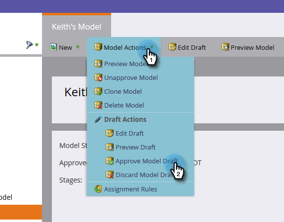

# 承認されたモデルの編集{#editing-your-approved-model}

## モデルの編集{#editing-your-model}

1. 「解析」セクションで変更するモデルを選択し、「**ドラフトを編集**」をクリックします。

   

1. ドラフトモデルの編集時に（モデルが承認された後で）ステージを削除することはできません。 代わりに、そのステージをモデル内の別のステージとマージできます。 マージするステージを右クリックし、「**Merge**」をクリックします。

   

1. 現在選択されているリードに対する新しいステージを選択するか、「**なし**」を選択してモデルからリードを削除します。 完了したら、**結合**&#x200B;をクリックします。

   

1. モデルの変更が完了したら、**モデルアクション**&#x200B;メニューで「**モデルドラフトを承認**」を選択して、モデルを再承認します。

   

   >[!TIP]
   >
   >ステージの追加やマージなど、変更を加えた場合は、編集内容を反映するために、割り当てルールとフェーズを変更してください。

## モデルの承認を取り消す{#unapproving-your-model}

>[!CAUTION]
>
>モデルを未承認にすると、そのリードはすべて削除され、モデル内の履歴は削除されます。 モデルを未承認にする代わりに、モデルを編集することを検討します。

1. 未承認にするモデルを選択します。 **モデルアクション**&#x200B;メニューから、**モデルの未承認**&#x200B;を選択します。

   

1. 「**未承認**」をクリックします。

   

>[!NOTE]
>
>このモデルを再承認する場合は、まずリードをステージに再割り当てする必要があります。

## より多くのモデルの作成{#creating-more-models}

一度に1つの承認済みモデルしか持つことができません。 モデルを承認したいが、既に1つの承認済みの場合は、最初に現在のモデルの承認を取り消す必要があります。 可能であれば、新しいモデルを作成する代わりに、モデルを編集してみてください。

>[!MORELIKETHIS]
>
>[新しい売上高モデルの作成](../../../../../product-docs/reporting/revenue-cycle-analytics/revenue-cycle-models/create-a-new-revenue-model.md)

