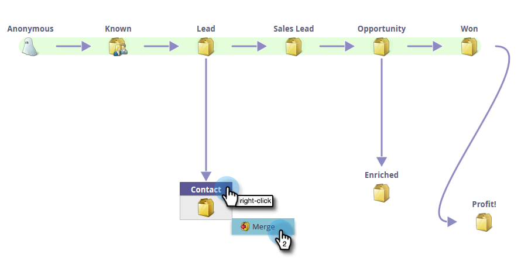
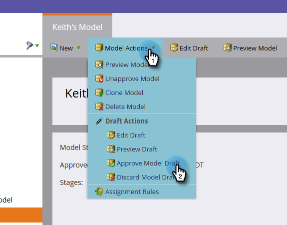
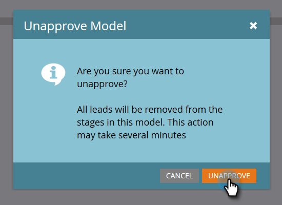

# 承認済みモデルの編集 {#editing-your-approved-model}

## モデルの編集 {#editing-your-model}

1. [!UICONTROL 分析]セクションで変更を加えるモデルを選択し、「**[!UICONTROL 下書きの編集]**」をクリックします。

   

1. （モデルの承認後に）ドラフトモデルの編集時にステージを削除できません。 代わりに、そのステージをモデル内の別のステージと結合できます。 結合するステージを右クリックし、「**[!UICONTROL 結合]**」をクリックします。

   

1. 選択したリードに既存する新しいステージを選択するか、「**[!UICONTROL なし]**」をクリックして、モデルからリードを削除します。 完了したら、**[!UICONTROL 結合]**&#x200B;をクリックします。

   

1. モデルの変更が完了したら、**[!UICONTROL モデルアクション]** メニューで&#x200B;**[!UICONTROL モデルドラフトを承認]**&#x200B;を選択して、モデルを再承認します。

   

   >[!TIP]
   >
   >ステージに追加や結合などの変更を加える場合、編集内容を反映するには、[!UICONTROL 割り当てルール]とフェーズを必ず変更してください。

## モデルの承認取消 {#unapproving-your-model}

>[!CAUTION]
>
>モデルの承認を取り消すと、すべてのリードが削除され、モデル内の履歴が削除されます。 承認を取り消す代わりに、モデルの編集を検討してください。

1. 承認取消するモデルを選択します。 **[!UICONTROL モデルアクション]**&#x200B;メニューで、「**[!UICONTROL モデルの承認を取り消す]**」を選択します。

   

1. 「**[!UICONTROL 承認取消]**」をクリックします。

   

>[!NOTE]
>
>このモデルを再承認する場合は、まずリードをステージに再割り当てする必要があります。

## さらに多くのモデルを作成する {#creating-more-models}

一度に作成できる承認済みモデルは 1 つだけです。 モデルを承認したいが、既に承認済みのモデルがある場合は、まず現在のモデルの承認を取り消す必要があります。 可能な場合は、新しいモデルを作成する代わりに、モデルを編集してみてください。

>[!MORELIKETHIS]
>
>[収益モデルの新規作成](/help/marketo/product-docs/reporting/revenue-cycle-analytics/revenue-cycle-models/create-a-new-revenue-model.md)
