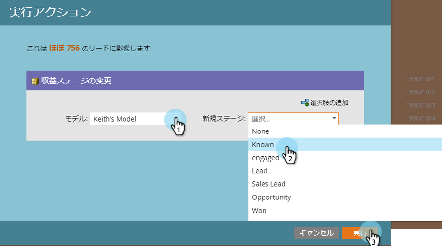
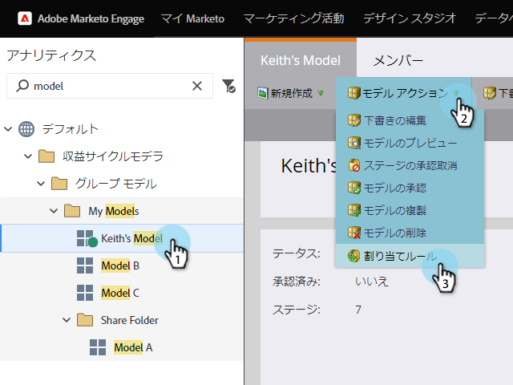

# ステージの承認と売上高モデルへのリードの割り当て {#approving-stages-and-assigning-leads-to-a-revenue-model}

既存のリードを追加し、新しいリードの割り当てルールを作成することで、 **売上高** ・ **モデル** (Revenue Model)を稼働状態にします。

## 承認ステージ {#approving-stages}

リードを追加する前に、モデルのステージを承認します。

1. 「**Analytics」 **領域に移動します。** **

   

1. ステージを承認するモデルを選択します。

   

1. 「 **モデルアクション**」で、「 **承認** ステージ ****」を選択します。

   

1. 警告を出して迎えられるだろう。「 **リードの割り当て**」をクリックします。

   

素晴らしい！ 先に進み、そのリードを割り当てましょう。

## 既存のリードの割り当て {#assigning-existing-leads}

[スマートリスト](../../../../product-docs/core-marketo-concepts/smart-lists-and-static-lists/creating-a-smart-list/create-a-smart-list.md) を作成して、リードデータベース内のモデルの1つのステージのリードを識別します。

1. スマートリストを [作成したら](../../../../product-docs/core-marketo-concepts/smart-lists-and-static-lists/creating-a-smart-list/create-a-smart-list.md)、「 **リード** 」タブをクリックします。

   

1. 「 **Select All** 」をクリックして、リードを選択します。

   

1. 「 **リードのアクション** 」ドロップダウンを開き、「 **特別**」を選択します。 「 **売上高ステージの**&#x200B;変更」をクリックします。

   

1. 正しい **モデル** と正しい **ステージを選択します**。 「今すぐ **実行**」をクリックします。

   

1. すべてのリードがモデルの様々なステージに割り当てられるまで繰り返します。

素晴らしい！ 新規引合をステージに割り当てる方法を指定するには、割り当てルールを作成します。

>[!NOTE]
>
>モデルが「承認済みのステージ」の状態の場合、リードのアクティビティログに売上高変更ステージイベントは表示されません。 モデルが完全に承認されている場合、リードを現在のステージと同じステージに移動すると、このフローステップはスキップされます。

## 新規リード：割り当てルールの作成  {#new-leads-create-assignment-rules}

1. 「** Marketto Home**」を再度クリックし、「 **Analytics**」を選択します。

   

1. `Click your model in the tree, then the`**`Model Actions`**`menu, selecting`**`Assignment Rules`** `.`

   

1. `If your assignment rules contain more than just one default choice click **Stage, **make your selection, then click`**`Add Choice`**`.`

   

## 割り当てルールの例 {#example-assignment-rule}

リードスコアルールを作成して、最小スコアの新しいリードを適切なステップに割り当てます。

1. 「 **If**」で「 **リードスコア**」を選択します。 少なく **とも**。` 

   `

1. フィールドに「 **40** 」と入力し、「 **Sales Lead** 」を「Stage」として選択します。 「 **保存** 」をクリックして完了します。

   

>[!NOTE]
>
>**関連記事**
>
>モデルを承認するには、ヘルプページの「**売上高モデルの [承認と未承認](approve-unapprove-a-revenue-model.md)*」を参照してください。

