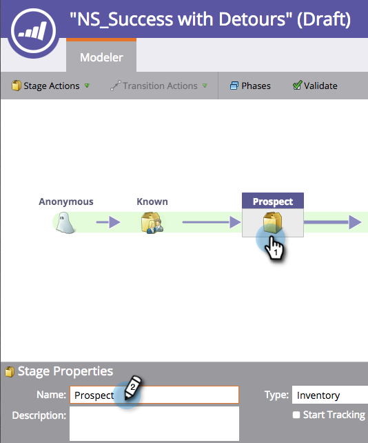

# ステージ名の変更{#changing-the-name-of-a-stage}

気が変わった？ 問題ありません。 売上サイクルモデラーでステージ名を変更するのは簡単です。

1. 「**Analytics**」領域に移動します。

   

1. 更新する売上高サイクルモデラーを選択します。 「**ドラフトを編集**」をクリックします。

   

1. 更新するステージを選択し、新しい&#x200B;**名前**&#x200B;を入力します。

   

1. 「**閉じる**」をクリックします。

   

   見た？ 簡単！ [モデル](/help/marketo/product-docs/reporting/revenue-cycle-analytics/revenue-cycle-models/approve-unapprove-a-revenue-model.md)の承認を忘れないでください。
